# EVM: Expert Virtual Memory
**Short-Horizon Working-Set Residency for Mixture-of-Experts Inference**

## Abstract
Mixture-of-Experts (MoE) language models contain many expert weights, but each token activates only a sparse subset. Expert Virtual Memory (EVM) is a memory architecture that converts expert storage from fixed full-model residency into an adjustable short-horizon working-set budget. The corrected thesis is not that a prompt uses a tiny permanent subset of experts. In the cleaned Qwen1.5-MoE trace, prompts eventually touch all 60 expert IDs. The relevant systems object is instead the active near-future working set during generation.

We implement a `llama.cpp` routing observatory, sanitize 27,972 full router rows across 50 prompts and 24 MoE layers, and measure short-horizon expert reuse. Median reuse distance is 3 tokens, and the 95th percentile is 17 tokens. A corrected layer-aware simulator separates weights with the same expert ID in different layers and evaluates on five held-out prompts. At 8/60 resident experts per layer, Oracle-EVM improves hit rate from 22.6% to 40.8%; a learned 3-to-17-token predictor reaches 28.1%, closing 30.4% of that gap without extra prefetch traffic. Runtime tests validate the memory path. CPU-backed EVM reduces peak GPU memory across three MoE models by 6.2-18.8 GB relative to native GPU runs.

These results establish the architecture and its present limit. RAM-backed exact-8 EVM reaches 1.90 tokens/s at 9,116 MB VRAM but still commits the model into host memory. The final disk-backed mode removes that requirement: cold experts remain in a non-prefetched GGUF file mapping, demanded experts enter an exact eight-slot CUDA pool, and Windows trims clean mapped pages after each graph. Across 3/3 trials it used at most 9,146 MB VRAM, 4,762 MB process RSS, about 4,807 MB additional system RAM, and zero page-file growth. Throughput was 0.40 tokens/s. EVM therefore proves true targeted expert loading without full-model RAM or page-file residency, but not production throughput.

We additionally implement static ability packs and an offline MoE MRI pipeline. A versioned six-domain diagnostic suite passed 12/12 isolated payloads on each of three MoE models. The finalized library expands this into 26 hierarchical domains and 156 explicit calibration, validation, and held-out prompts. Its execution workflow passed 26/26 domain-entry runs on Qwen1.5 and 6/6 stratified portability runs on each of DeepSeek and Qwen2. Positive-versus-contrast routing evidence produces layer-specific atlases, percentage selections, and human-readable labels without guessing expert contents. The finalized GPU-pack-only runtime preloads only the selected experts, releases their source mapping, keeps KV on GPU, and has no CPU expert fallback or cold vault. Fresh 37.5% runs passed on all three models at 4,378-16,412 MB peak VRAM and zero page-file growth. End-of-inference RSS was 219-1,089 MB. Pack-only remains a derived model and requires a separate quality gate.

The same static-pack runtime matrix was reproduced on Qwen1.5-MoE and DeepSeek-Coder-V2-Lite. All 36 cross-model runtime trials passed. Pack-only throughput was high on every model, but quality did not generalize: against 5/5 original-model baselines, Qwen1.5 retained only 1/5 sanity tasks at 25% and 3/5 at 37.5%, while DeepSeek retained 0/5 at both budgets. Runtime success therefore does not establish a production-quality derived pack.

## 1. Introduction
Consumer GPUs provide high compute throughput but limited VRAM relative to modern MoE model size. Sparsely gated MoE layers make this tension especially interesting because a router selects only a subset of experts for each token [1, 2]. Standard inference choices are coarse: keep more of the model resident for speed, or offload more of it to CPU memory for fit. EVM introduces a finer-grained alternative for MoE models: manage expert weights as a working set.

The key observation is that MoE routing is sparse per token. A prompt may eventually visit all experts, but generation only needs a near-future subset at any moment. EVM uses that distinction to turn expert memory from a fixed full-residency cost into an adjustable budget.

This has two practical motivations:

| Target | EVM goal |
| --- | --- |
| Larger-than-VRAM MoE inference | Keep nonresident experts in CPU memory or a lower tier and bring the active working set into GPU memory on demand. |
| Smaller MoE models that already fit | Give back expert VRAM for longer context, larger KV cache, draft models, adapters, or DSpark/speculative decoding workflows. |

### Related Work and Positioning

EVM borrows the systems idea of bounded residency but applies it to **expert weights**, not the KV cache. PagedAttention manages fragmented KV-cache storage across serving requests [4]; EVM keeps the router's expert choice intact while deciding which expert weights are resident in a compact CUDA pool. General limited-memory inference systems such as FlexGen and DeepSpeed Inference tier broad model state across GPU, CPU, and disk [5, 6]. EVM is narrower: it targets the sparse MoE expert dimension and measures the cost of exact demand loading at the individual expert level.

Direct MoE expert-caching and offloading precedents are especially relevant. Huang et al. introduce expert buffering that keeps hot experts in GPU memory and buffers the remainder in CPU memory [11]. SwapMoE maintains a dynamic set of virtual experts under a tunable memory budget [12], and Eliseev and Mazur study consumer-hardware MoE offloading [13]. EVM does not claim to be the first expert-cache proposal. Its contribution is an independently implemented `llama.cpp`/GGUF prototype with exact logical-to-physical CUDA remapping, a cleaned routing observatory, layer-aware LRU/Oracle/predictor analysis, explicit disk-only residency measurements, and an MRI/pack evaluation workflow.

Oracle-EVM is an offline application of the classical farthest-next-use **replacement rule** [3], not a deployable inference policy. The citation does not mean EVM uses an operating-system page file or reproduces a 1960s virtual-storage implementation; it supports only the perfect-future eviction upper bound. Predictive-EVM is the proposed online counterpart. Speculative decoding is a separate optional workflow that can use VRAM freed by EVM for a draft model; it is not used to establish the core EVM memory results [7]. The runtime prototype is built as a paper-contained patch series against `llama.cpp`, while the tested Qwen2 and DeepSeek-Coder-V2 model families are documented by their respective technical reports [8, 9].

### Research Provenance and AI Assistance

Kevin Price initiated EVM as an independent local-hardware research project, not as a reproduction or implementation of any individual cited paper. Generative-AI tools assisted with exploratory implementation, debugging, analysis, and writing. Their complete training provenance is not independently auditable. The literature review and citations were added to accurately credit the established ideas and direct prior art relevant to the completed prototype. The original contribution claim is therefore limited to the implementation, measurements, artifact package, and conclusions documented here.

The paper answers six questions:

1. Can we capture valid MoE routing traces from `llama.cpp`?
2. Do cleaned traces show short-horizon expert reuse?
3. How large is the LRU-to-Oracle opportunity ceiling inside EVM?
4. What predictor gap remains between naive LRU and deployable Predictive-EVM?
5. Can the runtime mechanisms needed by EVM be validated in `llama.cpp`?
6. Which EVM workflow should be used for each deployment scenario?
7. Can offline routing MRI produce reusable static expert packs across different MoE model families?

## 2. EVM Architecture
EVM treats expert weights like pageable memory objects. The router remains authoritative: EVM does not change which experts the model should use. EVM only changes where expert weights reside and how quickly the requested expert can be presented to the existing MoE computation path.

The architecture has three policy levels:

| Level | Role |
| --- | --- |
| LRU-EVM | Naive cache policy: evict the least recently used resident expert when the pool is full. |
| Oracle-EVM | Offline upper bound: evict the resident expert whose next use is farthest in the future, using perfect knowledge of the trace. |
| Predictive-EVM | Deployable target: predict near-future expert demand from information available during inference. |

LRU-EVM and Oracle-EVM are not `llama.cpp` CPU/GPU offload baselines. They are policies inside the EVM simulator. Traditional offload remains a separate baseline for runtime evaluation.

## 3. Routing Observatory
We instrumented a local `llama.cpp` build to capture Qwen1.5-MoE router probability vectors. The sanitized dataset contains:

| Quantity | Value |
| --- | ---: |
| Prompts | 50 |
| Prompt-token pairs | 1,214 |
| Valid router rows | 27,972 |
| MoE layers | 24 |
| Experts per layer | 60 |
| Stored top-k entries per row | 4 |

The trace pipeline filters out malformed scalar instrumentation rows and keeps only full 60-probability router vectors. This sanitization matters because earlier rough traces overstated locality.

**Result 1:** The routing observatory produces valid full-vector MoE telemetry suitable for reuse-distance and cache-policy analysis.

## 4. Short-Horizon Reuse
The cleaned trace does not support the claim that each prompt uses a small permanent subset of expert IDs. Every prompt in the sample eventually touches all 60 expert IDs. At the layer/expert level, prompts use a mean of 982.0 unique layer/expert pairs, with a range of 823-1219 out of 1,440 possible.

That does not invalidate EVM. EVM depends on short-horizon reuse, not total eventual coverage.

| Metric | Value |
| --- | ---: |
| Reuse observations | 62,788 |
| Immediate next-token reuse | 29.5% |
| Median reuse distance | 3 tokens |
| 75th percentile | 7 tokens |
| 90th percentile | 13 tokens |
| 95th percentile | 17 tokens |
| 99th percentile | 28 tokens |

**Result 2:** Expert demand has a moving short-horizon working set. The active next-window expert demand is more structured than the prompt's eventual expert coverage.

## 5. Layer-Aware LRU-EVM vs Oracle-EVM
This section answers one narrow question:

How much improvement is theoretically available if expert residency decisions were predicted perfectly?

LRU-EVM is the naive EVM policy. When the expert pool is full, it evicts the least recently used resident expert. Oracle-EVM is an offline upper-bound policy based on Belady's farthest-next-use replacement principle [3]. It has perfect future knowledge of the sanitized routing trace and evicts the resident expert whose next use is farthest in the future, or never used again. This is a trace-analysis policy only; it is unrelated to Windows page-file behavior. Oracle-EVM is not deployable and cannot be used during real inference.

The first simulator version incorrectly keyed the cache only by expert ID. That treated expert 7 in layer 3 and expert 7 in layer 19 as the same weight and overstated reuse. The final simulator maintains an independent cache for each layer and resets state at prompt boundaries. It uses a 40-prompt training split, 5-prompt validation split, and 5-prompt held-out test split. The transfer model remains an 80 MB object over a 28 GB/s PCIe path, or approximately 2.86 ms per demand miss.

| Capacity | LRU hit rate | Oracle hit rate | Hit-rate improvement | LRU misses | Oracle misses | LRU stall | Oracle stall | Stall reduction |
| ---: | ---: | ---: | ---: | ---: | ---: | ---: | ---: | ---: |
| 8/60 | 22.6% | 40.8% | +18.2 pp | 7,637 | 5,837 | 21.82 s | 16.68 s | 23.6% |
| 12/60 | 31.2% | 47.4% | +16.2 pp | 6,786 | 5,187 | 19.39 s | 14.82 s | 23.6% |
| 16/60 | 37.5% | 50.8% | +13.3 pp | 6,161 | 4,852 | 17.60 s | 13.86 s | 21.2% |
| 20/60 | 41.0% | 52.4% | +11.3 pp | 5,818 | 4,699 | 16.62 s | 13.43 s | 19.2% |
| 24/60 | 44.7% | 52.8% | +8.1 pp | 5,456 | 4,659 | 15.59 s | 13.31 s | 14.6% |
| 30/60 | 48.9% | 52.8% | +3.9 pp | 5,038 | 4,656 | 14.39 s | 13.30 s | 7.6% |
| 40/60 | 52.3% | 52.8% | +0.5 pp | 4,706 | 4,656 | 13.45 s | 13.30 s | 1.1% |
| 50/60 | 52.8% | 52.8% | +0.0 pp | 4,656 | 4,656 | 13.30 s | 13.30 s | 0.0% |

**Result 3:** Perfect replacement decisions have the largest value under tight residency. At 8/60 capacity, Oracle reduces modeled demand-miss stall by 23.6% relative to LRU. Cold-start misses dominate at high capacity, so LRU and Oracle converge.

## 6. Learned Short-Horizon Predictor
Oracle-EVM is an upper bound, not a production predictor. A deployable policy must estimate future expert use from current and past information.

The final predictor is a ridge-regularized layer-specific model. Its input is the current 60-value router-probability vector and its target is weighted expert demand 3 to 17 tokens ahead. Training uses 40 prompts; prefetch budget selection uses 5 validation prompts; the table below is from 5 untouched test prompts. Validation penalizes every prefetch as PCIe traffic. The selected production policy uses learned eviction scores but no speculative prefetch transfers because extra prefetch traffic did not reduce total transfers.

| Capacity | LRU hit | Learned hit | Oracle hit | Learned stall reduction | LRU-to-Oracle gap closed |
| ---: | ---: | ---: | ---: | ---: | ---: |
| 8/60 | 22.6% | 28.1% | 40.8% | 7.2% | 30.4% |
| 12/60 | 31.2% | 36.3% | 47.4% | 7.4% | 31.2% |
| 16/60 | 37.5% | 41.4% | 50.8% | 6.2% | 29.3% |
| 20/60 | 41.0% | 45.6% | 52.4% | 7.8% | 40.7% |
| 24/60 | 44.7% | 48.3% | 52.8% | 6.6% | 45.3% |
| 30/60 | 48.9% | 50.8% | 52.8% | 3.8% | 49.5% |
| 40/60 | 52.3% | 52.6% | 52.8% | 0.7% | 62.0% |
| 50/60 | 52.8% | 52.8% | 52.8% | 0.0% | 0.0% |

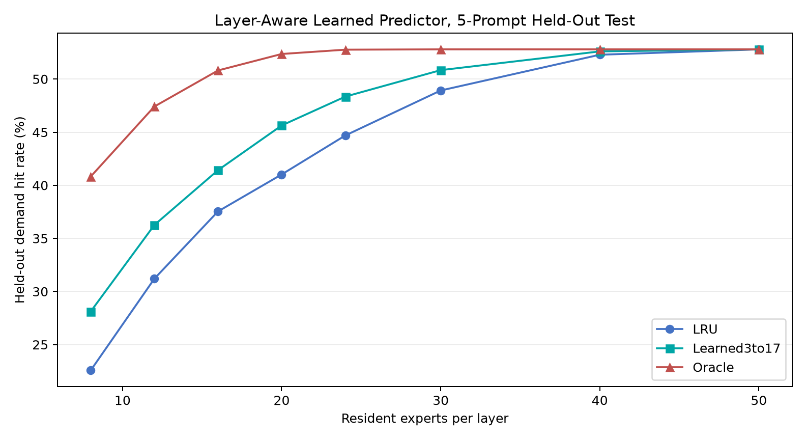

**Result 4:** A deployable, held-out learned predictor beats LRU at every constrained capacity from 8 to 40 experts per layer. It closes about 30% of the opportunity gap at the compact 8- and 12-expert budgets. This validates the signal, but the predictor is not yet wired into the Qwen2 CUDA scheduler.

## 7. Runtime Mechanism Validation
The runtime work validates two mechanisms needed by EVM:

1. **CPU-backed expert placement:** targeted experts can be kept out of full GPU residency, reducing peak GPU memory.
2. **CUDA logical-to-physical remapping:** GPU-backed EVM can intercept `ggml_cuda_mul_mat_id`, remap logical expert IDs into a compact physical pool, and execute through existing CUDA kernels without custom kernels.

### 7.0 Experimental Setup

All runtime figures in this paper were collected on one local Windows workstation. The hardware and local GGUF artifacts are recorded in [the experimental setup record](EXPERIMENTAL_SETUP.md); the concise reproduction-critical fields are below.

| Category | Recorded setup |
| --- | --- |
| CPU | AMD Ryzen 9 5900X, 12 cores / 24 logical processors |
| RAM | 31.9 GiB physical memory |
| GPU | NVIDIA GeForce RTX 3090 Ti, 24,564 MiB reported GPU memory |
| OS | Windows 11 Pro, build 22631 |
| NVIDIA driver | 610.62 |
| CUDA toolkit used for the local build | CUDA 13.2 |
| EVM runtime | Patched `llama.cpp` at `c5b04c42c71d553f28260d20c3238fce3c13bbd3`, with upstream base `6f8895feec96773574c7e10fcf7b56965d23550a` |

| Local GGUF artifact | On-disk size | Routed experts per targeted tensor | Source-model context |
| --- | ---: | ---: | --- |
| `Qwen1.5-MoE-A2.7B-Chat-Q3_K_M.gguf` | 6.93 GiB | 60 | Qwen1.5-MoE-A2.7B-Chat [14] |
| `DeepSeek-Coder-V2-Lite-Base-Q4_K_M.gguf` | 9.65 GiB | 64 | DeepSeek-Coder-V2 [9] |
| `qwen2-57b-a14b-instruct-q4_k_m.gguf` | 32.46 GiB | 64 | Qwen2 [8] |

The GGUF quantizations are local inference artifacts, not the original upstream checkpoints. Measurements are single-workstation results and should not be generalized to different PCIe generations, GPUs, storage devices, operating systems, or llama.cpp revisions without replication.

### 7.1 VRAM-Residency Result
The original memory proof compares maximum GPU placement with CPU-backed EVM using matched short prompts. Peak GPU memory is sampled with `nvidia-smi`. For Qwen2, “native” means EVM disabled with `-ngl 99`; the 34.9 GB model cannot fit in 24 GB VRAM, so that row uses Windows shared/host backing and is not a full-GPU-residency baseline.

| Model | Native GPU peak | CPU-backed EVM 33% peak | VRAM reduced | GPU-resident reduction | Native gen t/s | CPU-backed gen t/s | Validity |
| --- | ---: | ---: | ---: | ---: | ---: | ---: | --- |
| Qwen1.5-MoE-A2.7B | 8,034 MB | 1,823 MB | 6,211 MB | 77.3% | 88.40 | 33.90 | no CUDA error/artifact |
| DeepSeek-Coder-V2-Lite | 10,773 MB | 1,769 MB | 9,004 MB | 83.6% | 88.40 | 19.50 | no CUDA error/artifact |
| Qwen2-57B-A14B | 24,223 MB | 5,465 MB | 18,758 MB | 77.4% | 2.50 | 2.20 | no CUDA error/artifact |

These three model samples show that CPU-backed EVM materially reduces GPU expert residency across model scales. The measured reduction ranges from 77.3% to 83.6% of sampled peak GPU memory. This proves the central VRAM claim in the current prototype: EVM-style expert placement can give back GPU memory on models that already fit and can make larger models runnable with a smaller GPU-resident expert set. The cold weights still exist in CPU RAM, so the win is tiering scarce VRAM, not deleting total model storage.

The cost is throughput. On the averaged Qwen1.5-MoE reproduction sweep, CPU-backed EVM 33% generated at 35.62 +/- 1.08 tokens/s. That is much slower than the native GPU baseline at 107.06 +/- 29.82 tokens/s, but faster than the CPU-only baseline at 24.90 +/- 0.91 tokens/s. EVM is therefore not presented here as a speedup over full GPU residency. It is a memory-for-speed trade that frees VRAM for longer context, larger KV cache, draft models, adapters, or speculative decoding workflows.

For Qwen2-57B-A14B, CPU-backed EVM is also faster than a matched traditional constrained llama.cpp fit/offload control. With EVM disabled, `-ngl auto`, `--fit on`, `--fit-target 19500`, GPU KV, and the same short prompt shape, the traditional constrained row generated at 1.00 token/s and peaked at 4,584 MB. The CPU-backed EVM residency row generated at 4.60 tokens/s and peaked at 5,370 MB. This supports the larger-than-VRAM motivation: targeted expert placement can be materially faster than coarse traditional constrained offload.

The earlier 63% unified row recovered speed by allocating most experts again: 4.90 tokens/s at 23,227 MB. It was below native peak, but it was not a useful compact working set. The production correction adds `EVM_EXPERTS_PER_TENSOR`, enforces it as a hard allocation ceiling, uses `-ub 1` for generation, and aborts instead of silently growing the pool when one CUDA call requests more unique experts than the declared capacity.

With an exact 8-expert pool, GPU KV cache, CPU expert backing, and counter-emitting CUDA remapping, Qwen2-57B completed 3/3 independent 16-token trials at 1.50, 2.30, and 2.30 tokens/s: 2.03 +/- 0.46 tokens/s. Maximum peak VRAM was 9,113 MB, 15,066 MB below the 24,179 MB native row. Hit rate was 28.92%, and each trial transferred 82,161.68 MB. This is the first strict low-VRAM unified row: the targeted-loading bug is fixed, but transfer volume prevents production speed.

The host-memory pass changes the interpretation. A matched 8-token CPU-backed row generated at 3.90 tokens/s and used 5,485 MB VRAM, but reached 23,719 MB process RSS, 34,327 MB private commit, and 4,192 MB of new page-file use. RAM-backed exact-8 unified EVM generated at 1.90 tokens/s and used 9,116 MB VRAM, 24,115 MB RSS, 37,838 MB private commit, and 5,092 MB of new page-file use. These modes save VRAM by moving storage into committed host memory; they do not satisfy the original active-experts-only total-residency goal.

Disk-backed exact-8 EVM does satisfy that goal. `EVM_DISK_BACKING=1` disables whole-model mmap prefetch. `EVM_DISK_TRIM=1` and `EVM_DISK_TRIM_INTERVAL=1` remove clean mapped pages from the process working set after each CUDA graph. Three repeated 8-token trials all passed with counters: 0.40 tokens/s, 9,146 MB maximum VRAM, 4,762 MB maximum process RSS, 4,807 MB maximum additional system RAM, and 0 MB page-file growth. Cold experts remain in the GGUF on NVMe; only demanded file pages, non-expert GPU weights, KV, and the exact CUDA expert pool are resident.

Two follow-up disk-I/O policies were implemented and tested. A shared pinned-host ring pipelines mmap-to-host copies with asynchronous host-to-device uploads while bounding pinned memory; 2, 4, and 8 slots all passed at 0.40 tokens/s and 4.7-4.8 GB process RSS. An adaptive file-page policy trims only after process RSS crosses an 8, 12, or 16 GiB high-water target. Those rows passed at 0.40, 0.40, and 0.30 tokens/s respectively, with 9.4, 13.9, and 16.5 GB peak RSS. Neither policy improved throughput. The bottleneck is therefore late demand discovery plus storage faults, not merely CUDA's pageable-host staging behavior.

Those CPU-side experiments are rejected as performance paths because they do not reduce repeated host-to-GPU expert traffic. The corrected control is GPU working-set capacity. With disk backing and process RSS held near 4.7 GB, increasing the physical pool from 8 to 16, 24, 32, and 40 experts per tensor raises hit rate from 32.08% to 48.89%, 58.80%, 64.84%, and 70.42%. Transfer volume falls from 59.2 GB to 44.6, 36.0, 30.7, and 25.8 GB. Throughput improves from 0.40 to 0.50, 0.50, 0.60, and 0.60 tokens/s while VRAM rises from 9,146 MB to 12,896, 16,459, 19,894, and 23,530 MB. This is the valid adjustable EVM curve, but it reaches the GPU ceiling before recovering RAM-backed performance. Even its best row remains slower than the 1.00 token/s traditional constrained-offload control and the 3.90 token/s committed-RAM EVM row, so disk-backed EVM is a memory proof rather than the adopted performance path.

GPUDirect Storage is a different transport, not full-model GPU residency. It DMA-transfers requested file ranges into caller-provided GPU buffers, so EVM could still keep an exact bounded CUDA pool. NVIDIA documents this as a direct storage-to-GPU path that avoids a CPU bounce buffer ([GDS overview](https://docs.nvidia.com/gpudirect-storage/overview-guide/index.html)). It is not a runnable backend on the tested machine: the installed Windows CUDA stack has no cuFile headers or library, and NVIDIA's current P2PDMA support list names datacenter GPUs rather than the RTX 3090 Ti ([GDS requirements](https://docs.nvidia.com/gpudirect-storage/troubleshooting-guide/)). A future Linux/datacenter EVM backend must pass GGUF file offsets and lengths to cuFile and DMA only predicted experts into the same bounded pool; it must not preload the model.

Native CUDA tuning tested Flash Attention `auto/on/off` and microbatch sizes 1 and 4. The best row was Flash Attention on with `-ub 1`: 6.30 tokens/s at 23,951 MB VRAM. The other rows were 4.90-6.20 tokens/s. A custom kernel rewrite was not adopted because the oversized Qwen2 run is dominated by host/shared-memory residency and expert transfer, not an unoptimized full-resident CUDA kernel.

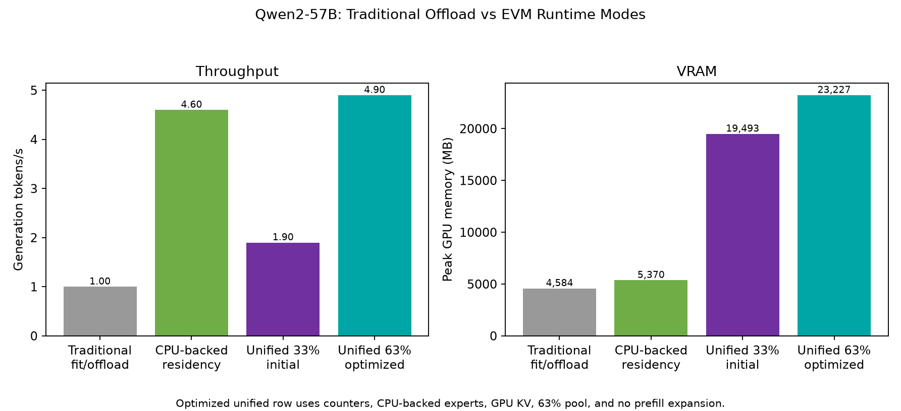

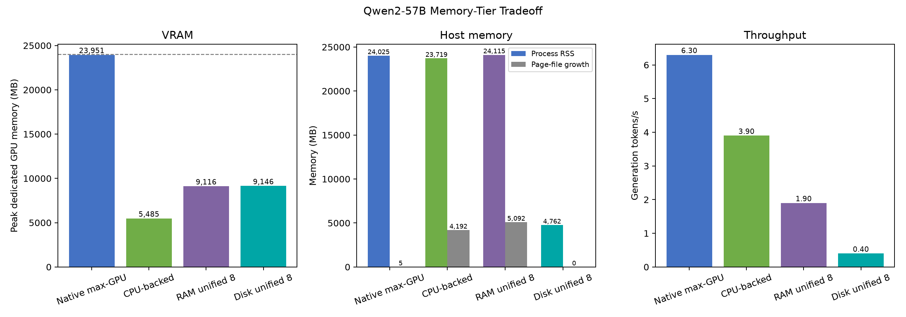

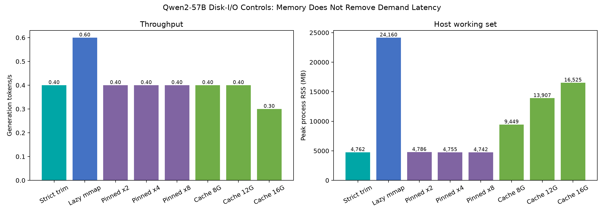

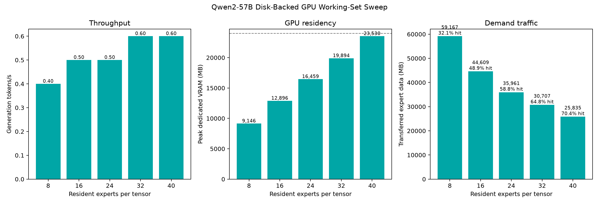

The memory accounting distinguishes five objects: GPU non-expert weights, GPU KV cache, the CUDA expert pool, RAM-backed cold experts, and file-backed cold experts. CPU-backed EVM commits cold weights to RAM. Disk-backed EVM maps the GGUF without whole-file prefetch and trims clean pages, so the file remains the authoritative cold tier rather than the Windows page file.

The memory chart separates two EVM modes. **CPU-backed EVM** is the VRAM-saving path: cold expert tensors are kept out of GPU residency and backed by CPU RAM, which trades throughput for VRAM headroom. **GPU-backed EVM** is a mechanism-validation path: the original experts remain GPU resident and EVM allocates an additional physical expert pool, so peak GPU memory increases. GPU-backed EVM is useful for proving logical-to-physical CUDA remapping, not for proving VRAM reduction. A GPU-only VRAM-saving variant would need the nonresident experts to leave full GPU residency, for example by using CPU/NVMe backing, compressed GPU backing, or another lower tier; simply segregating experts inside GPU memory does not save VRAM if the original full expert set remains resident.

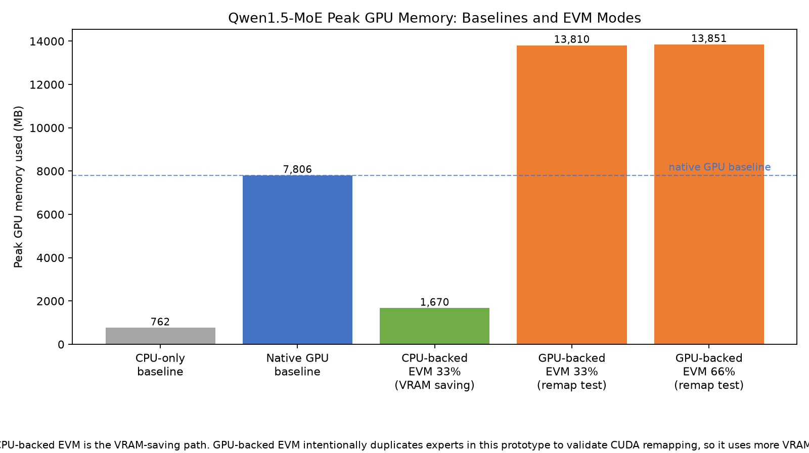

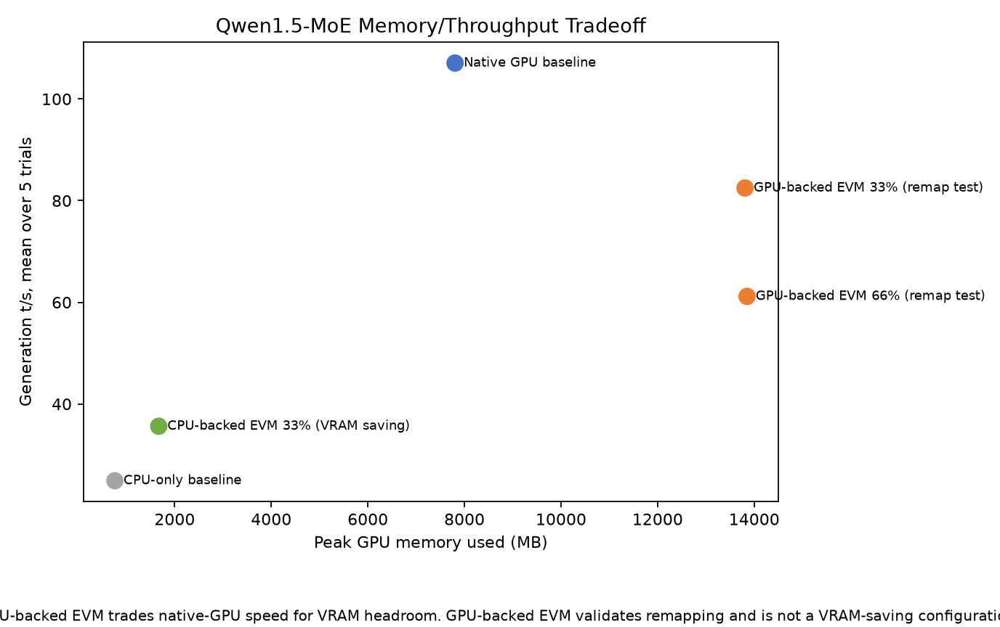

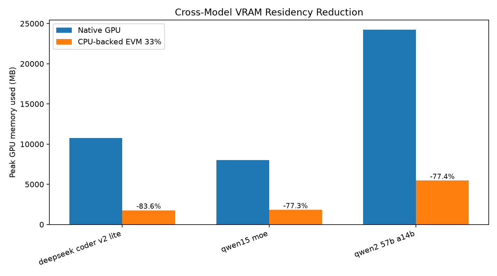

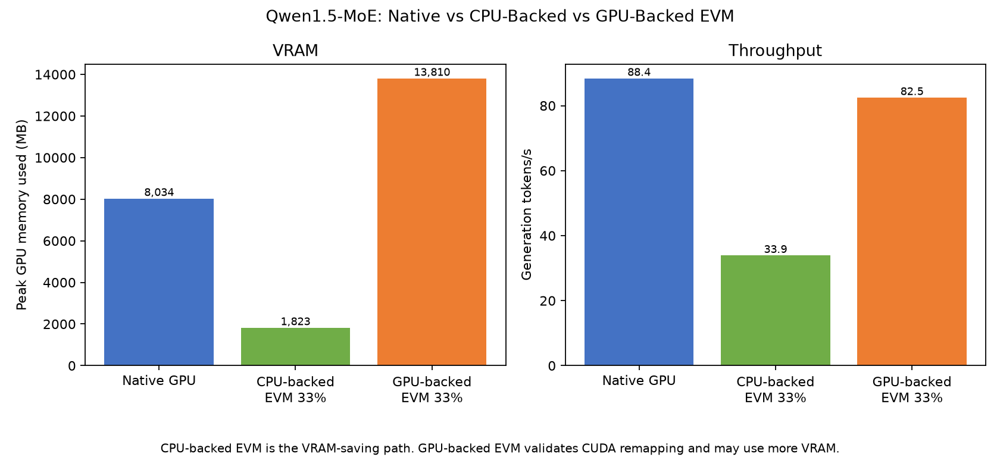

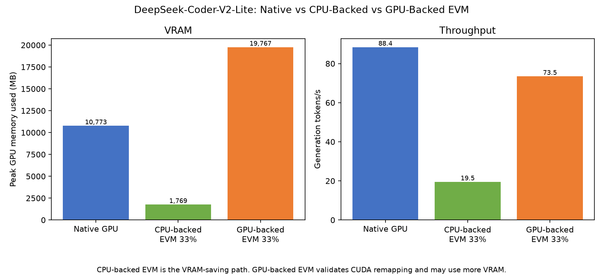

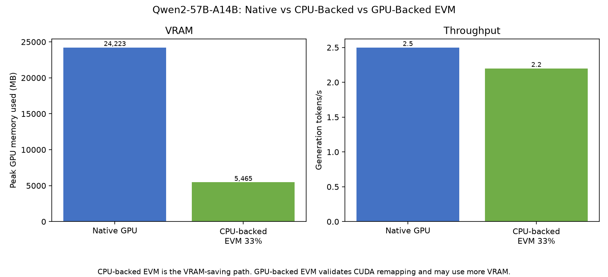

### 7.2 GPU-Backed Expert Segregation
GPU-backed EVM answers a different question from CPU-backed EVM: can the runtime intercept the MoE expert operation and replace logical expert IDs with physical pool slots while still using existing CUDA kernels? On Qwen1.5-MoE, yes. At 33% requested capacity, the memory proof run emitted 8,782 hits and 6,938 misses for a 55.87% hit rate. At 66% requested capacity, it emitted 10,331 hits and 5,389 misses for a 65.72% hit rate. The debug probe also logs repeated `EVM: intercepting mul_mat_id experts=60` lines and completes without CUDA errors or invalid-generation artifacts.

DeepSeek-Coder-V2-Lite also validates GPU-backed remapping when `EVM_TARGET_EXPERT_COUNT=64` is used. A 5-trial GPU-backed EVM 33% sweep completed 5/5 valid trials with no CUDA errors or artifacts. The run emitted 48,150 cache hits, 25,620 cache misses, a 65.27% hit rate, and 6,670 total `mul_mat_id` intercepts. Mean generation throughput was 73.48 +/- 2.25 tokens/s. Peak GPU memory reached 19,767 MB because this remains the duplicate GPU-backed remapping path.

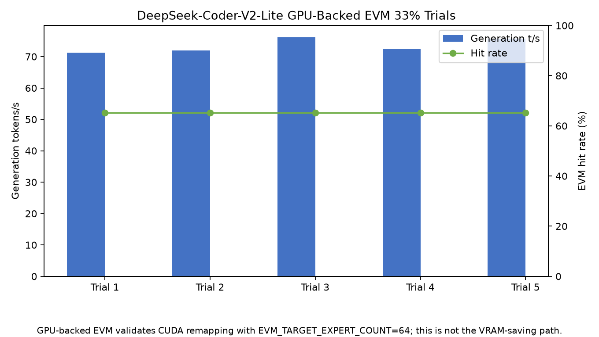

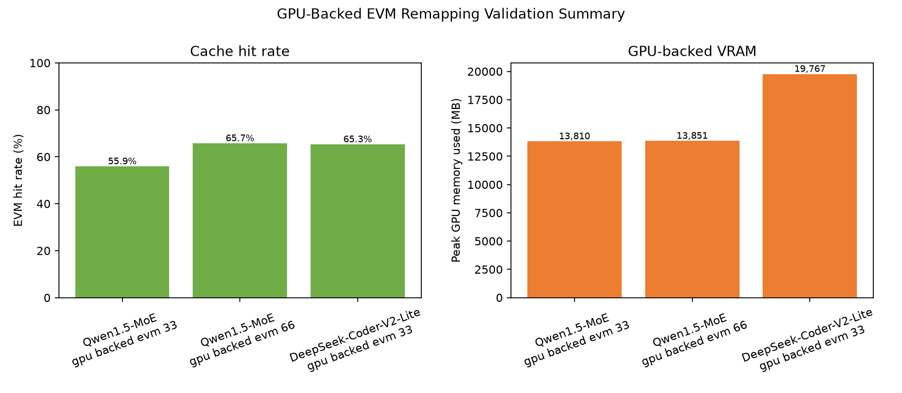

This is the targeted expert-segregation test for a model that already fits fully in GPU memory. It demonstrates that expert calls can be routed through an EVM-managed physical pool. It does not reduce VRAM in the current implementation because the source expert tensors are still GPU resident. The practical VRAM-saving version for already-fitting models is CPU-backed EVM, which moves cold experts out of VRAM. GPU-backed EVM is still valuable because it validates the remapping mechanism that the final CPU-to-GPU streaming design needs.

The GPU-backed validation is currently claimed for Qwen1.5-MoE and DeepSeek-Coder-V2-Lite. Qwen2-57B-A14B is included in the CPU-backed VRAM-residency proof, but not in the GPU-backed CUDA-remapping proof. Qwen2's native GPU peak was 24,223 MB on the test GPU, leaving too little headroom for the current duplicate GPU-backed pool.

### 7.2.1 GPU Page-Table Hit Path

The runtime now includes an opt-in `EVM_GPU_PAGE_TABLE=1` path for models with at most 64 routed experts per tensor. CUDA maps logical expert IDs through a device-resident logical-to-physical page table and writes the physical IDs directly into the existing `mul_mat_id` input buffer. It returns only an active-expert bitmask and a miss flag to the host. A miss takes the established exact CPU service path, which copies the required expert slice into the compact pool; no router weight, selected ID, or expert math is changed.

Three matched 48-token, eight-slot trials passed the five-prompt full-model fingerprint gate on both small models. Qwen1.5-MoE moved from 12.47 to 15.23 generation tokens/s (+22.13%) at the same 2,644 MB peak VRAM. DeepSeek-Coder-V2-Lite moved from 10.93 to 10.27 tokens/s (-6.04%) at the same 2,896 MB peak VRAM. The GPU mapper handled 141 and 113 aggregate cache-hit calls respectively, but CPU fallback still handled 5,437 and 4,987 miss calls. The result validates exact on-device hit remapping, not a universal speedup: current cache capacities still miss too often, and the host synchronizes on the small miss-status transfer. The evidence table is `docs/tables/gpu_page_table_runtime.csv`.

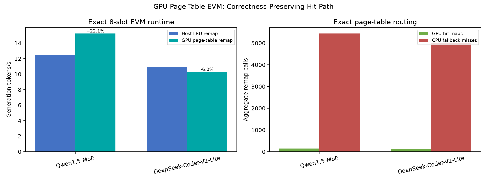

### 7.2.2 Conservative Router-Score Prefetch

The runtime now exposes the normal MoE router-score tensor to EVM after routing and before the expert operation. `EVM_ROUTER_SCORE_PREFETCH=1` ranks currently unresident experts by that probability vector and queues up to one copy into an actually empty physical slot. It does not evict an expert speculatively, alter top-k selection, or block the current expert kernel on that copy; the candidate is available to a later token if it is needed.

At eight slots and 48 tokens, three matched trials preserved 5/5 full-model fingerprints on both models. Qwen1.5-MoE improved from 13.03 to 15.67 generation tokens/s (+20.26%) with 150 score-driven prefetches and a 22.17% hit rate. DeepSeek-Coder-V2-Lite fell from 11.63 to 10.53 tokens/s (-9.46%) despite 81 prefetches and a nearly unchanged 34.29% hit rate. This is a real score bridge and an exact asynchronous copy path, but its conservative empty-slot rule has limited room after warmup. The policy is therefore opt-in and model-specific, not a claim that router-score prefetch universally improves MoE inference. Evidence: `docs/tables/router_score_prefetch_runtime.csv`.

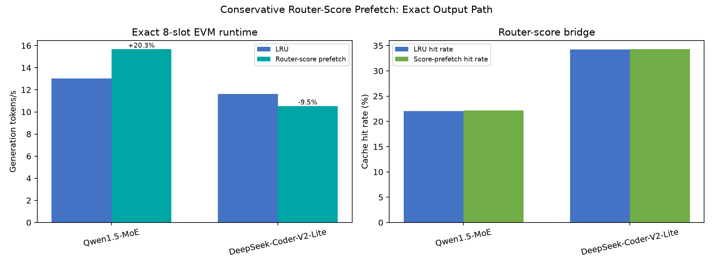

### 7.2.3 Steady-State Capacity Gate on the Two Small Models

Before returning to the oversized Qwen2 target, we repeated the exact constrained-runtime test on both smaller MoE layouts with one-token microbatches and 96 generated tokens. This separates initial cache fill from the generation working set. At 48 demand slots per tensor on Qwen1.5 and 40 on DeepSeek, ordinary exact LRU reached the requested 80--90% steady-generation availability band in three valid counter-emitting trials per model.

| Model | Demand slots per tensor | LRU valid trials | LRU generation t/s | LRU hit rate | Mean peak VRAM | Exact token gate |
| --- | ---: | ---: | ---: | ---: | ---: | --- |
| Qwen1.5-MoE | 48/60 | 3/3 | 37.10 | 81.71% | 9,037 MB | 5/5 |
| DeepSeek-Coder-V2-Lite | 40/64 | 3/3 | 21.10 | 81.58% | 7,360 MB | 5/5 |

This is an availability gate, not a compact-cache victory: both points require a substantial fraction of each layer's expert pool. It does establish that the counter-emitting exact runtime is stable in the target band on two distinct MoE layouts. The full evidence is `docs/tables/steady_state_small_model_residency.csv`.

The follow-up `EVM_ROUTER_SCORE_PREFETCH=1` implementation ranks up to eight router candidates on CUDA, transfers only those IDs and scores to the scheduler, and protects two reserved predictive slots from demand eviction. It preserves output equivalence (5/5 hashes on both small models), but it is not adopted: on Qwen1.5 it moved hit rate only from 81.71% to 83.63% while reducing generation from 37.10 to 25.93 tokens/s. The policy remains an opt-in research control until a future predictor can improve availability without reducing throughput.

An additional 32-slot learned 3--17-token score bridge was tested after four-fold Qwen2 offline replay reached 80.53% mean predicted hit rate (78.92% LRU; 79.93% weakest fold). The runtime implementation ranks predicted candidates on CUDA and uses them to protect likely future residents without issuing a speculative copy. It is also rejected: one valid Qwen1 smoke moved 59.11% to 59.37% hits but fell from 22.5 to 14.4 tokens/s; one valid DeepSeek smoke moved 71.50% to 72.03% but fell from 11.9 to 10.6 tokens/s. The host candidate bridge still synchronizes every routed layer, erasing the modest eviction benefit. A production predictor requires a fully device-resident page-table and eviction scheduler, not another host-mediated policy.

The first GPU-scheduler prototype moves the complete future-score vector to CUDA and returns it to the host only after a page-table miss. It is paired with the existing GPU logical-to-physical mapper. This removes the candidate-vector bridge but not the mandatory miss-status synchronization or CPU/NVMe service call. At 32 slots, it is a NO-GO smoke on both small models: Qwen1 page-table-only generated at 16.0 tokens/s and GPU-scheduler at 15.0 tokens/s; DeepSeek generated at 17.2 and 14.1 tokens/s respectively. The design is retained as an opt-in research hook, not an adopted workflow. Meaningful further progress requires a look-ahead source of future routes or a GPU-addressable cold tier; moving only the eviction score is insufficient.

| Evidence | Model | Capacity | Baseline | Learned / GPU-scheduler result | Oracle | Decision |
| --- | --- | ---: | ---: | ---: | ---: | --- |
| Four-fold offline replay | Qwen2-57B-A14B | 32/64 | 78.92% LRU hit rate | 80.53% learned hit rate | 84.16% hit rate | Signal exists; runtime bridge required |
| Runtime smoke | Qwen1.5-MoE | 32/60 | 16.0 t/s GPU page table | 15.0 t/s GPU scheduler | n/a | NO-GO |
| Runtime smoke | DeepSeek-Coder-V2-Lite | 32/64 | 17.2 t/s GPU page table | 14.1 t/s GPU scheduler | n/a | NO-GO |

The generated source data is `docs/tables/gpu_scheduler_final_evidence.csv`.

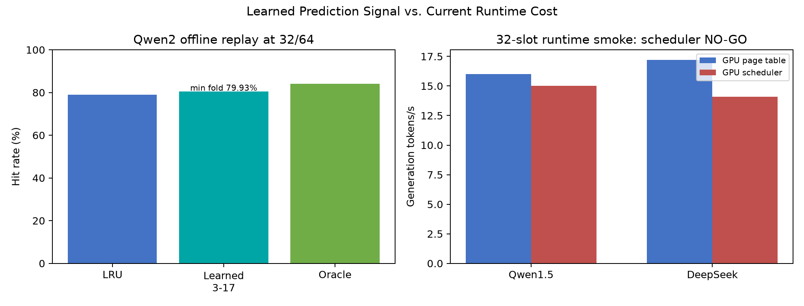

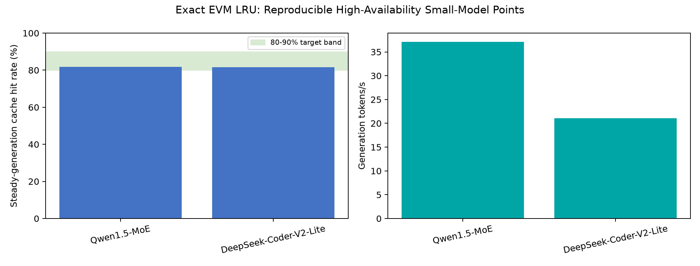

### 7.3 Reproduction Trials
The final reproduction sweep repeats Qwen1.5-MoE runtime tests five times per configuration.

| Run | Valid trials | Prompt t/s mean +/- std | Generation t/s mean +/- std | EVM hit rate | Avg transferred | CUDA/artifact trials |
| --- | ---: | ---: | ---: | ---: | ---: | ---: |
| CPU-only baseline | 5/5 | 27.96 +/- 0.78 | 24.90 +/- 0.91 | n/a | 0.00 MB | 0/0 |
| Native GPU baseline | 5/5 | 198.60 +/- 50.25 | 107.06 +/- 29.82 | n/a | 0.00 MB | 0/0 |
| CPU-backed EVM 33% | 5/5 | 29.14 +/- 0.60 | 35.62 +/- 1.08 | n/a | 0.00 MB | 0/0 |
| GPU-backed EVM 100% | 5/5 | 123.46 +/- 33.77 | 83.28 +/- 19.48 | 76.13% | 5,451.06 MB | 0/0 |
| GPU-backed EVM 80% | 5/5 | 103.60 +/- 30.89 | 72.86 +/- 19.52 | 68.78% | 7,642.29 MB | 0/0 |
| GPU-backed EVM 66% | 5/5 | 108.68 +/- 22.31 | 61.16 +/- 20.94 | 65.72% | 8,558.56 MB | 0/0 |
| GPU-backed EVM 33% | 5/5 | 123.90 +/- 6.39 | 82.48 +/- 2.85 | 55.87% | 11,499.00 MB | 0/0 |

The throughput table should be read as a tradeoff table. CPU-backed EVM is much lower throughput than native GPU execution, but it is faster than the CPU-only baseline because non-expert GPU layers can still run on the GPU while expert residency is reduced. GPU-backed EVM is slower than native GPU because the prototype pays remapping, synchronization, and pool-copy overhead; its role here is mechanism validation.

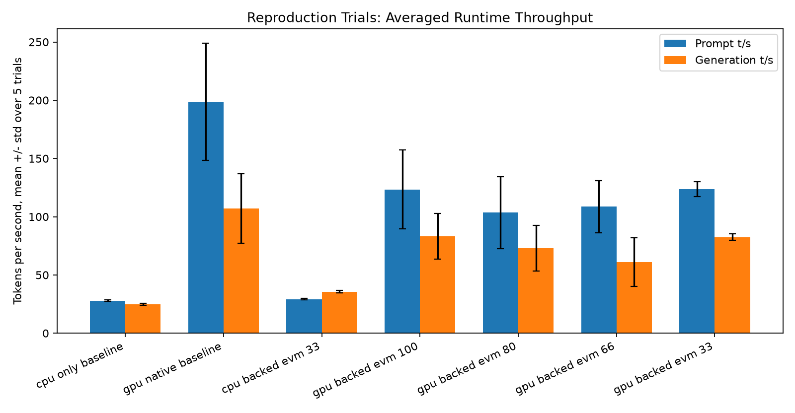

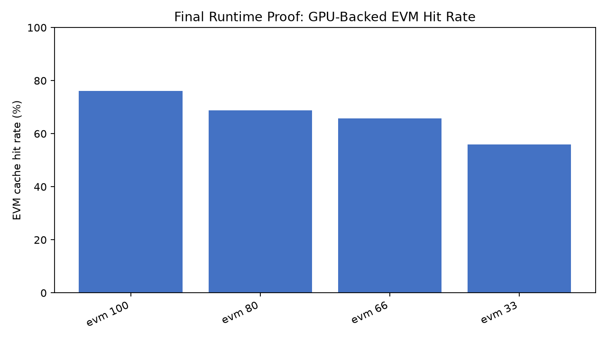

**Result 5:** EVM has a completed counter-emitting runtime proof path. CPU-backed residency proves substantial GPU-memory reduction across Qwen1.5-MoE, DeepSeek-Coder-V2-Lite, and Qwen2-57B-A14B. Unified streaming combines CPU-backed expert storage with a compact CUDA EVM pool and emits counters on all three models. The fusion-aware path fixes the fused MoE gate/up bypass by coordinating physical expert IDs across the fused tensors, and it passes repeated validation on all three models.

### 7.4 Path to Useful Speed
The initial CPU-backed prototype proved VRAM reduction but did not emit CUDA EVM counters. The current controlled pass adds a unified streaming path: CPU-backed expert storage, CUDA EVM pool remapping, explicit GPU KV cache, strict budget controls, and required EVM counters in the same run.

| Model | Mode | Peak GPU memory | Generation t/s | EVM counters | Hit rate | Bytes transferred | Validity |
| --- | --- | ---: | ---: | --- | ---: | ---: | --- |
| Qwen1.5-MoE | Native GPU | 7,966 MB | 108.70 | no | n/a | n/a | valid |
| Qwen1.5-MoE | CPU-backed residency | 1,830 MB | 33.30 | no | n/a | n/a | valid residency-only |
| Qwen1.5-MoE | GPU-backed remap | 11,067 MB | 41.00 | yes | 43.27% | 15,007.01 MB | valid remap-only |
| Qwen1.5-MoE | Unified streaming | 4,943 MB | 30.50 | yes | 43.27% | 15,007.01 MB | valid unified |
| Qwen1.5-MoE | Unified fusion-aware | 4,942 MB | 36.20 | yes | 39.62% | 19,605.95 MB | valid fused unified |
| DeepSeek-Coder-V2-Lite | Native GPU | 10,785 MB | 31.70 | no | n/a | n/a | valid |
| DeepSeek-Coder-V2-Lite | CPU-backed residency | 1,699 MB | 18.90 | no | n/a | n/a | valid residency-only |
| DeepSeek-Coder-V2-Lite | GPU-backed remap | 15,343 MB | 32.90 | yes | 61.97% | 11,754.53 MB | valid remap-only |
| DeepSeek-Coder-V2-Lite | Unified streaming | 6,257 MB | 23.70 | yes | 61.97% | 11,754.53 MB | valid unified |
| DeepSeek-Coder-V2-Lite | Unified fusion-aware | 6,270 MB | 22.40 | yes | 48.61% | 19,093.42 MB | valid fused unified |
| Qwen2-57B-A14B | Native max-GPU/shared | 23,951 MB | 6.30 | no | n/a | n/a | valid; 34,079 MB private commit |
| Qwen2-57B-A14B | CPU-backed residency | 5,485 MB | 3.90 | no | n/a | n/a | valid; 23,719 MB RSS |
| Qwen2-57B-A14B | Unified streaming 33% | 19,493 MB | 1.90 | yes | 59.80% | 37,621.99 MB | valid unified |
| Qwen2-57B-A14B | Unified streaming 63% optimized | 23,227 MB | 4.90 | yes | 69.13% | 22,555.93 MB | valid 3/3 optimized |
| Qwen2-57B-A14B | Unified fusion-aware | 19,494 MB | 1.90 | yes | 58.98% | 52,431.91 MB | valid fused unified |
| Qwen2-57B-A14B | RAM unified, exact 8 | 9,116 MB | 1.90 | yes | 32.08% | 59,167.09 MB | valid; 24,115 MB RSS |
| Qwen2-57B-A14B | Disk unified, exact 8 | 9,146 MB max | 0.40 | yes | 32.08% | 59,167.09 MB | 3/3 valid; 4,762 MB RSS; no page-file growth |

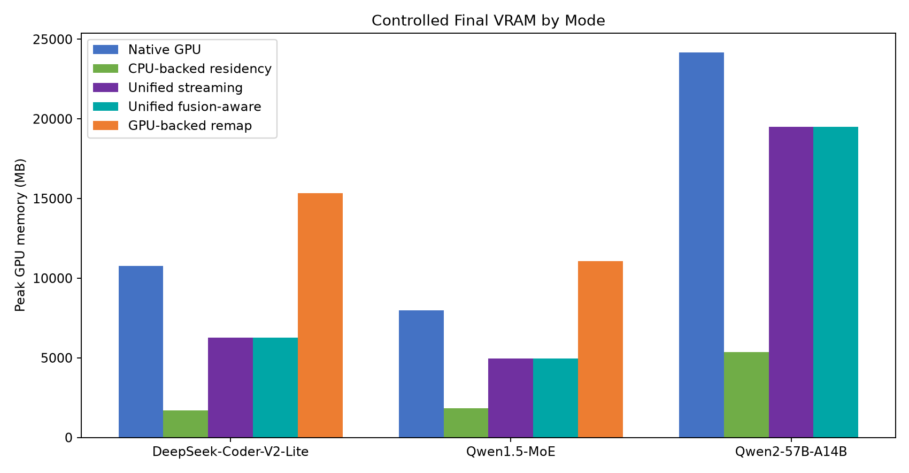

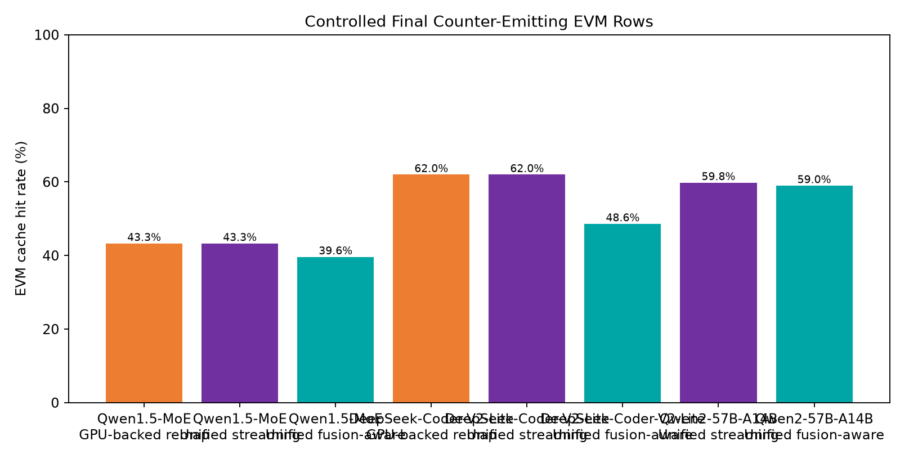

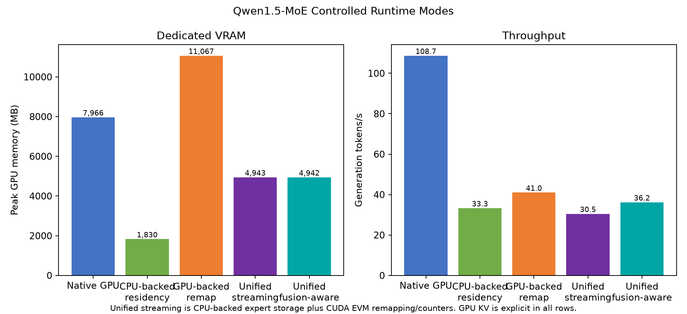

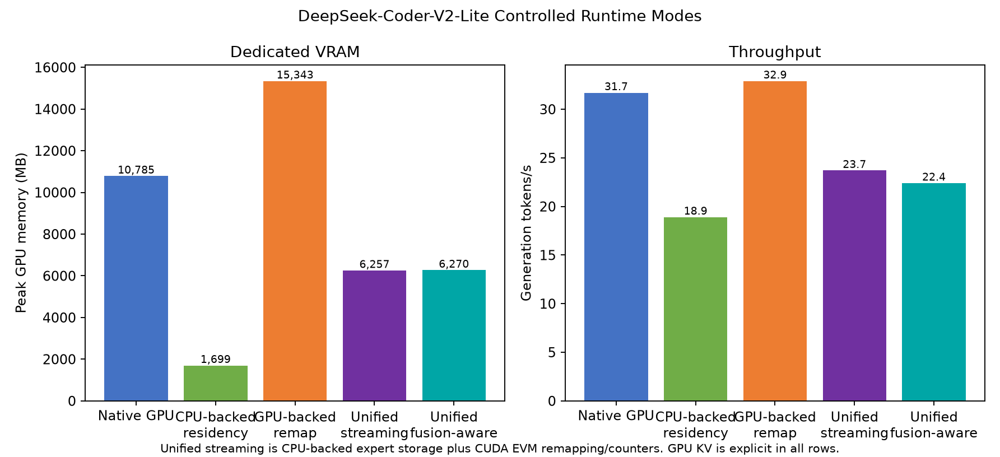

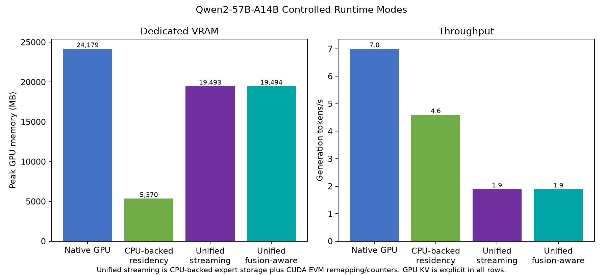

The disk compact row closes the total-residency gap: cold experts are file-backed rather than committed to RAM, the CUDA pool is fixed at eight experts per tensor, counters are emitted, GPU KV is explicit, and page-file growth is zero. Pool reuse is ordered with CUDA events and physical ID uploads use double-buffered pinned staging. Demand misses now pay both storage and PCIe latency, which explains the 0.40 tokens/s result.

The fusion-aware variant is a correctness fix for fused MoE execution. llama.cpp can fuse the gate/up/GLU expert path and pass one shared expert-ID tensor into a fused CUDA kernel. A naive EVM remap can make the up tensor and gate tensor choose different physical slots, which is invalid. The final patch coordinates the logical-to-physical mapping across both expert tensors before entering the fused kernel. The repeated validation sweep completed 3/3 trials per model:

| Model | Valid trials | Mean peak GPU memory | Generation t/s mean +/- std | Hit rate | Mean transferred |
| --- | ---: | ---: | ---: | ---: | ---: |
| Qwen1.5-MoE | 3/3 | 4,874 MB | 38.57 +/- 9.84 | 43.29% | 12,770.14 MB |
| DeepSeek-Coder-V2-Lite | 3/3 | 6,198 MB | 22.87 +/- 3.17 | 44.60% | 17,285.98 MB |
| Qwen2-57B-A14B | 3/3 | 19,509 MB | 1.90 +/- 0.26 | 58.02% | 41,320.78 MB |

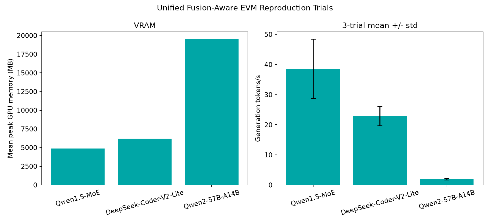

The plausible high-performance EVM path is now:

1. CPU pinned or memory-mapped expert backing.
2. Compact GPU expert pool.
3. Logical-to-physical expert remapping.
4. Asynchronous `cudaMemcpyAsync` prefetch.
5. A predictor better than LRU.
6. Phase-aware prefill and generation policy.

The expected win differs by scenario:

| Scenario | Realistic EVM win |
| --- | --- |
| Larger-than-VRAM MoE | Runs at all, and ideally much faster than traditional CPU/GPU offload. |
| Smaller MoE that already fits | Frees VRAM, with acceptable speed loss or near-native speed if prediction and prefetch are strong. |
| Smaller MoE plus draft/speculative workflow | Possible net workflow speedup because returned VRAM can hold a draft model or larger KV cache. |
| Same small model, same context, native full-GPU baseline | EVM is unlikely to beat full residency because all experts are already local. |

Therefore, EVM should be positioned as beating the memory wall, not beating the ideal full-GPU baseline when that baseline is available. For larger models, the alternative may be impossible full residency or slow traditional offload. For smaller models, the value is returning scarce VRAM for longer context, larger KV cache, adapters, or speculative decoding.

## 8. Adopted Workflow Paths
The final EVM workflow is not one universal mode. The results support different paths depending on whether the model already fits, whether VRAM is the bottleneck, and whether the objective is mechanism validation or usable deployment.

| Scenario | Adopted workflow | Why this path |
| --- | --- | --- |
| Larger-than-VRAM MoE, enough system RAM | CPU-backed EVM or RAM-backed unified EVM. | Faster than disk backing, but commits most model bytes into RAM and may use the page file. |
| Larger-than-VRAM MoE, strict total-memory budget | Disk-backed exact-capacity EVM. | Cold experts stay in the GGUF; measured page-file growth is zero, at a large throughput cost. |
| Smaller MoE that fits, but needs longer context or larger KV cache | CPU-backed EVM at a chosen expert budget, then spend returned VRAM on KV/cache/context. | Same-model throughput may fall, but scarce VRAM is made available for the actual workload target. |
| Smaller MoE plus draft/speculative decoding | CPU-backed EVM for the target MoE plus a draft model or speculative helper in the freed VRAM. | The win is end-to-end workflow speed or capability, not faster target-model generation alone. |
| Runtime mechanism validation | GPU-backed EVM. | This proves CUDA interception and logical-to-physical remapping without custom kernels, but it intentionally does not save VRAM in the current prototype. |
| Native full-GPU baseline fits and no extra VRAM is needed | Use native full-GPU residency. | EVM is not expected to beat an ideal all-resident baseline for the same model, prompt, and context. |

This yields the adopted implementation plan:

1. Use **native max-GPU/shared placement** for maximum measured Qwen2 speed on this 24 GB card.
2. Use **CPU-backed EVM** when VRAM is scarce and 24+ GB host residency is acceptable.
3. Use **disk-backed EVM** when both VRAM and committed RAM must remain bounded.
4. Use **GPU-backed EVM** only for remapping/policy validation when the model fits.
5. Keep speculative decoding optional; the tested draft pair is rejected.

**Result 6:** EVM is best understood as a family of workflow paths. The paper validates VRAM-residency reduction, CUDA remapping, and the unified CPU-backed CUDA streaming path. The production route for larger-than-VRAM and VRAM-constrained MoE inference is the unified path plus async prefetch and a deployable predictor.

### 8.1 Workflow Benchmarks
We added two workflow-level benchmark harnesses after the mechanism proof:

1. **Max-context workflow:** test whether CPU-backed EVM returns VRAM that can be spent on larger context/KV allocation.
2. **Speculative workflow:** test a concrete Qwen2-57B target plus Qwen1.5-MoE draft setup.

The max-context benchmark is successful. Both Qwen1.5-MoE and DeepSeek-Coder-V2-Lite completed all tested context allocations up to 65,536 tokens in native GPU and CPU-backed EVM modes. The key result is not that native failed; it did not fail in this tested range. The key result is that CPU-backed EVM preserves much more VRAM headroom at the same context length.

| Model | Mode | Highest tested context | Peak GPU memory | Generation t/s | Validity |
| --- | --- | ---: | ---: | ---: | --- |
| Qwen1.5-MoE | Native GPU | 65,536 | 20,121 MB | 54.30 | no CUDA error/artifact |
| Qwen1.5-MoE | CPU-backed EVM 33% | 65,536 | 13,985 MB | 31.30 | no CUDA error/artifact |
| DeepSeek-Coder-V2-Lite | Native GPU | 65,536 | 24,017 MB | 37.10 | no CUDA error/artifact |
| DeepSeek-Coder-V2-Lite | CPU-backed EVM 33% | 65,536 | 19,079 MB | 19.30 | no CUDA error/artifact |

At 65,536 context, CPU-backed EVM leaves 6,136 MB more VRAM headroom for Qwen1.5-MoE and 4,938 MB more for DeepSeek-Coder-V2-Lite than native GPU. This supports the workflow claim that expert residency can be traded for larger KV/context budgets, even when the maximum tested context was not exhausted.

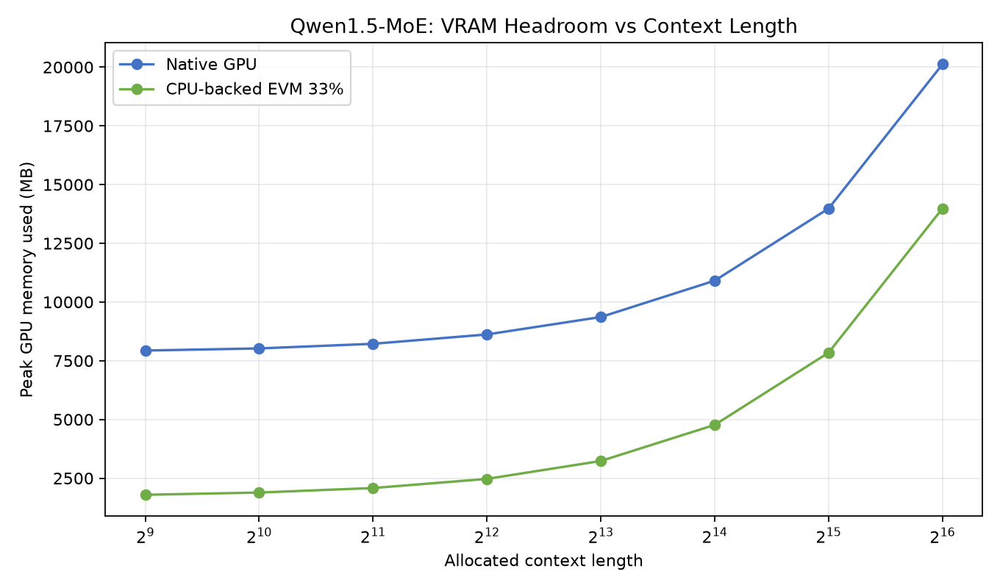

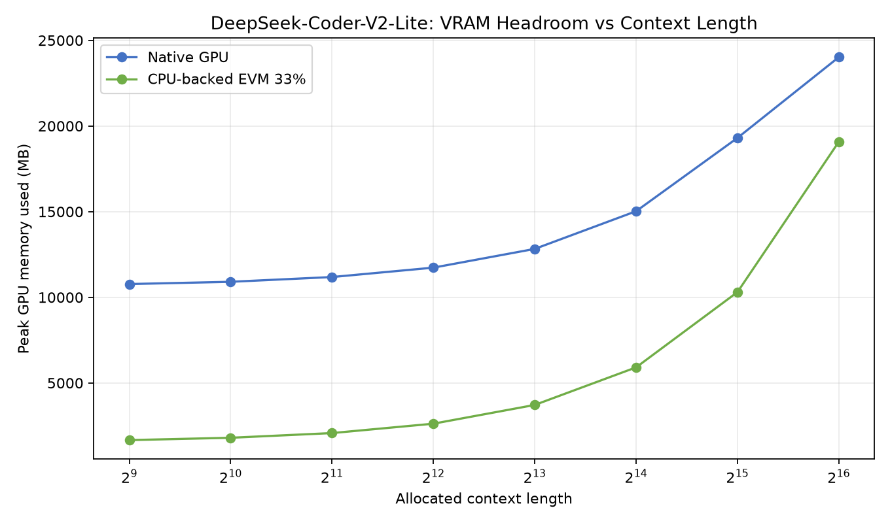

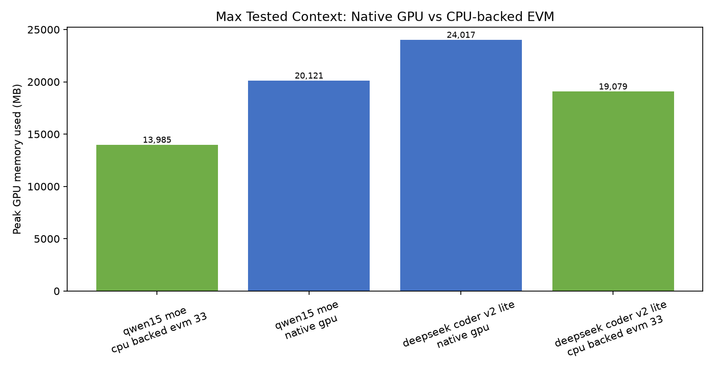

The optional speculative workflow now completes through the dedicated `llama-speculative` binary. The target is Qwen2-57B, the draft is Qwen1.5-MoE, and `EVM_TARGET_EXPERT_COUNT=64` prevents EVM from intercepting the 60-expert draft. The run generated at 0.54 tokens/s, accepted 40.0% of draft tokens, and peaked at 23,145 MB. It fails the production gate. Multi-token verification also exposed the old pool-growth bug because one batch can request more unique experts than a compact pool; strict capacity now aborts that case instead of consuming undeclared VRAM. Speculation remains optional and this model pair is rejected.

### 8.2 Unified Streaming Runtime
The current code validates the two halves of EVM separately and validates their combination on all three tested MoE models. The important distinction is that the faster Qwen2 CPU-backed residency row is not the same as the stricter unified EVM row. Residency-only proves VRAM placement but emits no EVM counters. Unified streaming proves that CPU-backed storage and CUDA logical-to-physical remapping are active in the same run, but demand misses and router-ID readback remain on the critical path.

| Mechanism | Current evidence | Limitation |
| --- | --- | --- |
| CPU-backed expert placement | Reduces peak GPU memory across Qwen1.5-MoE, DeepSeek-Coder-V2-Lite, and Qwen2-57B-A14B. | Does not emit CUDA EVM counters; this is the fast residency/offload-style placement proof, not the full EVM streaming proof. |
| GPU-backed remapping | Emits counters and validates logical-to-physical remapping on Qwen1.5-MoE and DeepSeek-Coder-V2-Lite. | Does not save VRAM because original experts remain GPU resident and the prototype allocates an additional physical pool. |
| Unified CPU-backed CUDA streaming | Emits counters while targeted experts are RAM-backed. | Exact-8 Qwen2 reaches 1.90 t/s but uses 24,115 MB RSS and grows the page file by 5,092 MB. |
| Unified disk-backed CUDA streaming | Non-prefetched GGUF mapping plus exact CUDA pool and working-set trimming. | 3/3 valid at 9,146 MB VRAM, 4,762 MB RSS, zero page-file growth, and 0.40 t/s. |
| Unified fusion-aware streaming | Coordinates physical expert IDs across fused gate/up CUDA kernels and passes 3/3 trials on all three models. | Correctness path, not the optimized path; it still needs predictive async prefetch and lower synchronization overhead. |

The unified runtime preserves a CUDA-visible expert pool while sourcing cold expert bytes from either committed RAM or a lazy GGUF mapping. `EVM_DISK_BACKING=1` disables whole-model mmap prefetch. On Windows, optional working-set trimming removes clean file-backed pages after a configurable number of CUDA graphs.

The CUDA manager now uses a separate transfer stream, `cudaMemcpyAsync`, event-ordered pool reuse, and double-buffered pinned ID uploads. This removes the unconditional host-side compute-stream barrier. It does not remove the required router-ID readback or the demand dependency: the compact Qwen2 row still transfers about 82 GB in a 16-token trial. The learned predictor is validated offline on held-out Qwen1.5 traces, but its weights are not yet integrated into the Qwen2 runtime.

The optional bounded disk-staging ring makes pageable mmap staging explicit and reusable. Its neutral benchmark result narrows the performance gap: transfer submission is not the main limiter while expert demand is discovered synchronously. The GPU-pool sweep then confirms that persistent expert residency reduces misses and transfer bytes monotonically, but demand loading remains too slow. Useful overlap requires prediction before the router's demanded IDs reach `mul_mat_id`; direct storage alone cannot create that lead time.

This is the controlled rewrite surface. It is a CUDA/llama.cpp integration rewrite, not a new MoE kernel family. The goal is to prevent the old CPU/GPU offload path from doing expert computation implicitly while EVM claims credit. A proof-grade unified row must satisfy all of the following checks: CPU-backed expert storage is active, CUDA EVM counters are emitted, the expert pool is the only GPU-resident targeted expert storage, KV placement is explicitly declared, and the run respects a declared dedicated-VRAM budget without crossing into uncontrolled Windows shared-memory spill.

The remaining integration work is required before a production-performance claim:

1. Capture Qwen2 router vectors and integrate the learned layer-specific model into the CUDA scheduler.
2. Prefetch only when predicted transfers replace demand misses without increasing total PCIe traffic.
3. Keep exact capacity and phase-aware microbatch controls; never grow past the declared budget.
4. Use a small tokenizer-compatible draft model with materially higher accepted tokens per target verification; the tested Qwen1.5-MoE draft is rejected.
5. Improve disk-backed throughput beyond the measured 0.60 tokens/s ceiling without returning to full host residency. Ten tokens/s is not a realistic gate on this hardware because the fastest max-GPU/shared row is 6.30 tokens/s.

The prototype exposes exact expert capacity, GPU reserve, phase controls, lazy disk backing, and Windows working-set trim cadence. The benchmark runner records GPU memory, process RSS, private commit, total system-RAM delta, and page-file delta in addition to throughput and EVM counters.

## 9. Phase-Aware Residency
Prefill and generation stress expert residency differently. During prefill, many prompt tokens are evaluated together, so a micro-batch can request a broad expert footprint. During generation, new tokens arrive one step at a time, making short-horizon reuse more valuable.

EVM should therefore use phase-aware policy:

| Phase | Access pattern | Residency policy |
| --- | --- | --- |
| Prefill | Broad batch-level expert demand | Larger temporary quota or smaller microbatches |
| Generation | Short-horizon temporal reuse | Exact predictive pool with optional asynchronous prefetch |

The runtime uses `EVM_PREFILL_BATCH_THRESHOLD` as an initial phase-aware control. This keeps the paper's results scoped correctly: EVM's strongest benefit is expected during autoregressive generation, while prefill may need a different quota.

## 10. Discussion
The corrected EVM narrative is stronger than the original semantic-slicing claim. A prompt-level expert subset is not small in the cleaned trace, but the active near-future working set is reusable enough to make expert residency policy meaningful.

The results also separate VRAM-residency reduction from CUDA remapping:

| Mechanism | Validated in this paper | Evidence |
| --- | --- | --- |
| CPU-backed expert placement | Yes | Peak GPU memory falls by 6,211 MB on Qwen1.5-MoE, 9,004 MB on DeepSeek-Coder-V2-Lite, and 18,758 MB on Qwen2-57B-A14B. |
| GPU-backed logical-to-physical remapping | Yes on Qwen1.5-MoE and DeepSeek-Coder-V2-Lite | EVM hit/miss counters emitted across repeated valid GPU-backed trials. |
| Unified RAM-backed CUDA streaming pool | Yes | Counter-emitting exact-8 Qwen2 passes, but host RSS remains about 24 GB. |
| Unified disk-backed CUDA streaming pool | Yes | 3/3 valid with 9,146 MB VRAM, 4,762 MB RSS, and no page-file growth. |

This distinction is important but not fatal to the architecture. The paper proves that expert storage can be moved out of scarce VRAM into a lower memory tier, expert IDs can be remapped into a managed pool without custom kernels, and the two mechanisms can operate together under a hard capacity. The current weak point is throughput: low capacity produces too many PCIe transfers.

### CPU spine with permanently GPU-resident experts

We tested the inverse placement on Qwen1.5-MoE-A2.7B Q3_K_M, a model small enough for a clean control. Five repeated 64-token trials measured full GPU residency at 57.91 +/- 10.58 t/s and 10,850 MB peak VRAM. Keeping all transformer layers on CPU while forcing every routed-expert tensor onto CUDA measured 32.21 +/- 4.46 t/s and 10,216 MB. The CPU-layer control measured 31.05 +/- 3.55 t/s and 1,294 MB.

This proves that CPU-spine/GPU-expert placement is executable, but it is not the preferred EVM architecture. It gained only 3.7% over the CPU-layer control, lost 44.4% against full GPU residency, and returned only 634 MB of VRAM. Moving expert weights per token is worse, but moving activations across the CPU/GPU boundary at every MoE layer is still expensive. The useful target remains a GPU-resident spine plus a bounded GPU expert working set, with lower-tier experts prefetched asynchronously.

### Static ability packs and offline MoE MRI

Static packs remove demand transfer from the installed subset. The dense Qwen2 spine remains 4.65 GB. The 25% pack contains 16 of 64 layer-local experts in every layer and occupies 6.95 GB; the 37.5% pack contains 24 and occupies 10.43 GB. Each pack includes complete gate, up, and down slices for every selected `(layer, expert)` pair. Percent residency is the portable policy; absolute counts are derived per model.

The reusable offline MRI pipeline performs structural GGUF scanning, categorized calibration inference, aggregate expert profiling, layer-local ranking, pack selection, and human-readable reporting. It does not retain generated text. Calibration inference remains necessary because weights alone do not identify expert semantics. The fixed `evm-mri-diagnostic-suite-v1` payload contains six domains: general explanation, software coding, formal reasoning, science, creative language, and instruction/safety behavior. Two isolated payloads per domain passed on every model, for 36/36 total runs.

Human-readable labels are evidence-gated. For each `(layer, expert)`, the analyzer compares domain-normalized routing lift against all contrast domains. High confidence requires at least 100 observations, 1.5x lift, and a 0.25 lift margin over the runner-up; medium confidence requires 25 observations, 1.2x lift, and a 0.10 margin. Experts below these gates are labeled `shared_cross_domain` or `inconclusive`. These names describe measured routing association, not inferred knowledge storage.

### 26-domain MRI library

The production prompt library is separated from the frozen six-domain reproduction fixture. It contains 26 domains and 156 explicit prompts in three hierarchical groups: computer/agent work, professional reasoning, and language/human interaction. Computer workflows distinguish code generation, debugging, review, systems programming, web development, data scripting, tool calling, planning, structured output, and repository navigation. Professional workflows distinguish technical writing, business operations, scientific reasoning, mathematics, formal logic, research synthesis, legal-style reasoning, medical-style reasoning, and financial analysis. Language workflows distinguish instruction following, safety/refusal, conversation/support, creative writing, multilingual work, factual recall, and long-context synthesis.

Every domain defines what it measures, what it excludes, and its nearest contrast domains. Four calibration prompts may influence expert ranking; one validation prompt may choose residency and confidence thresholds; one held-out prompt is reserved for final association and quality checks. This prevents the same two prompts from selecting and certifying a pack.

The library schema and all 156 prompts pass automated validation. Execution verification used one calibration entry per domain on Qwen1.5, passing 26/26. A six-domain stratified sample covering code generation, tool calling, planning, scientific reasoning, instruction following, and long-context synthesis passed 6/6 on DeepSeek and 6/6 on Qwen2. Thus the extended runner passed 38/38 isolated executions. This proves the expanded taxonomy is executable across the three model layouts; it does not claim that every one of the 156 prompts has been run on every model.

### Full 7,800-prompt corpus and graph-pack gate

The complete deterministic calibration corpus was subsequently run on all three models: 2,600 prompts per model, 7,800/7,800 valid prompts total. Qwen1.5 completed in 2,297.85 seconds at 35.13 generation tokens/s; DeepSeek completed in 2,679.69 seconds at 32.01 tokens/s; Qwen2 completed in 22,267.42 seconds at 3.28 tokens/s through the exact external-vault path. The runs produced 374,400, 405,600, and 436,800 prompt/phase/tensor routing records respectively.

Raw top-eight co-activation is too dense to define a pack directly. We therefore retained only pairs with positive pointwise mutual information of at least 0.5 bits and support across at least four underlying semantic-seed families. This reduced Qwen1.5 from 37,904 raw edges to 4,426 refined edges, DeepSeek from 26,056 to 3,989, and Qwen2 from 35,894 to 3,657. The refined graph produced 37.5% computer/agent packs that differed from the frequency selections in 18/24 Qwen1.5 layers, 17/26 DeepSeek layers, and 13/28 Qwen2 layers.

We then evaluated frequency and graph packs with eight deterministic workflow checks for code generation, debugging, review, systems programming, tool calling, planning, structured output, and repository navigation. Qwen1.5 scored 5/8 on its original baseline and 2/8 on both packs; DeepSeek scored 4/8 baseline, 1/8 frequency, and 2/8 graph. These are NO-GO results. Qwen2 used the stable exact external-vault path as its unchanged-model baseline because the Windows shared-memory native placement stalled; it scored 5/8 exact, 6/8 frequency, and 5/8 graph. This is a narrow positive frequency-pack result, not a general graph-pack win. The compact gate is insufficient for deployment: all pack policies still require the sealed validation and held-out suites, broader semantic seeds, and regression checks before adoption.

As a smaller-model refinement, an automated runner constructed and hash-verified 50% and 75% frequency and core-plus-workflow-overlay packs for Qwen1.5 and DeepSeek. A broader 12-check baseline-relative gate required retaining every check the original model passed. Qwen1.5 frequency improved from 6/9 retained checks at 50% to 8/9 at 75%; core-overlay retained 6/9 and 7/9. DeepSeek frequency retained 4/8 at 50% and 7/8 at 75%; core-overlay retained 2/8 and 4/8. No candidate met the strict retention gate, so both models remain NO-GO. This result is useful: larger residency helps, but the current deterministic pack-only implementation still loses at least one baseline capability, and the core-overlay heuristic is not a measured improvement over frequency selection.

### Restricted-router verification

We replaced the old post-routing deterministic substitution with a true restricted router: the pack index creates a per-layer availability mask before GGML top-k selection, and the surviving expert weights are normalized in the existing MoE graph. A CUDA guard aborts rather than substitutes if a masked-out expert reaches the expert pool. The resulting GPU-only smokes were valid with zero substitutions: Qwen1.5 at 75% reached 48.3 t/s at 6,439 MB peak VRAM, DeepSeek at 75% reached 23.5 t/s at 8,597 MB, and Qwen2 at 37.5% reached 36.7 t/s at 16,213 MB. The stronger 12-check quality gate remained NO-GO: Qwen1.5 frequency/overlay scored 2/12 and 0/12, DeepSeek scored 2/12 and 3/12, and Qwen2 scored 0/12 and 0/12, against 9/12 original-model baselines in each run. Thus this change closes a correctness loophole but does not turn static partial packs into quality-preserving models. The script-derived evidence table is `docs/tables/router_mask_quality.csv`.

### Exact EVM hash gate

Approximate static packs and exact EVM must not share a quality claim. We added a deterministic five-question token-fingerprint gate that runs a full-GPU model and an exact CPU-backed EVM pool with the same temperature and compares every generated token ID. Qwen1.5 and DeepSeek each matched 5/5 fingerprints at an eight-expert CUDA pool capacity. The quality patterns also matched their respective baselines: Qwen1.5 3/5 and DeepSeek 5/5. This proves the current exact fallback path preserves the tested token streams; it does not prove that it is fast enough or that the five prompts are a complete quality evaluation. Reproduce with `scripts/verify_evm_hash_match.py`; the generated table is `docs/tables/exact_evm_hash_match.csv`.

### Online cache-prior pilot

The live runtime now includes an opt-in per-layer online transition predictor. It observes routed expert sets, predicts one likely next resident candidate, and queues an asynchronous exact prefetch after the current demand transfer. A 35% confidence threshold suppresses weak predictions; the predictor never masks an expert or changes router weights. Both models preserved 5/5 full-model token fingerprints with the predictor enabled. In three exact eight-slot trials, Qwen1.5 improved from 12.33 to 16.50 generation t/s (+33.82%) at the same 2,646 MB peak VRAM. DeepSeek changed from 11.10 to 10.97 t/s (-1.17%) at the same 2,898 MB. This is a promising but non-universal speed result: confidence gating removed the prior transfer storm, but DeepSeek needs a better model or policy before claiming a general throughput gain. See `docs/tables/online_predictor_small_models.csv`.

DeepSeek refinement confirms that more threshold tuning is not the next lever. At capacity eight, raising the confidence gate to 50% reduced prefetches but remained slower than its matched LRU control (10.65 versus 11.55 t/s, two trials). At capacity ten, both policies used 3,130 MB and the predictor again lost (10.20 versus 10.90 t/s). The next research phase must capture per-token full router probabilities and train a layer-specific probability predictor with an explicit lead-time objective; the aggregate Markov transition prior is retained as a safe baseline only. Script-derived rows are in `docs/tables/deepseek_predictor_refinement.csv`.

### Cross-model router-vector training artifact

That next data-collection step is now reproducible on both small-model layouts. The shared 24-prompt contract captured 42,250 full-vector rows across 27 layers and 64 experts for DeepSeek, and 37,748 rows across 24 layers and 60 experts for Qwen1.5, with 24/24 valid prompts and no malformed rows in each capture. A chronological 60/20/20 prompt split trains the layer-specific 3-to-17-token ridge model, selects prefetch budget on validation prompts, and evaluates only the final five held-out prompts. At an eight-expert capacity, learned score-guided eviction reached 67.00% versus 61.97% LRU hit rate on DeepSeek and 62.54% versus 58.07% on Qwen1.5; in these two traces it matched the simulator Oracle row. Validation selected a prefetch budget of zero for both, so this is evidence that full router vectors can guide replacement, not evidence of hidden-transfer throughput. The artifacts are offline-only until the learned weights are connected to the CUDA scheduler and pass the exact hash and throughput gates. See `docs/tables/layer_aware_predictor_training.csv`.

The learned weights are now exported into an opt-in, model-agnostic CUDA scheduler prior. The runtime cannot read full router probabilities after top-k routing, so it projects the learned layer matrix from the current routed expert IDs and uses the resulting score only to choose an eviction victim; it does not mask routes, substitute experts, or speculate a transfer. In three matched 48-token exact-EVM trials at eight slots per tensor, DeepSeek improved from 6.90 to 11.20 generation t/s (+62.32%) at 2,898 MB peak VRAM, while Qwen1.5 improved from 13.47 to 15.37 t/s (+14.11%) at 2,646 MB. Both learned runs matched 5/5 full-model token fingerprints. This is a valid small-model runtime result, but it does not establish the same gain for Qwen2 or a disk-backed large-model path. See `docs/tables/learned_scheduler_runtime.csv`.

### Qwen2 under the 32 GB host limit

We repeated the same training workflow on Qwen2-57B-A14B using the exact compact spine-plus-vault path because an isolated load of the 35 GB original GGUF made no routing progress during a controlled four-minute launch on the 32 GB host. The compact capture completed 8/8 prompts with 9,264 clean full-vector rows across 28 layers and 64 experts. Its held-out simulator result improved from 60.15% LRU to 65.20% learned hit rate, but the runtime did not inherit that gain: three exact eight-slot trials averaged 0.93 generation t/s for both LRU and learned eviction at about 9,009 MB VRAM and 24.1-24.2 GB additional system RAM. A 4, 6, or 8 GB declared GPU-headroom run was a no-go before EVM counters could begin: the approximately 16 GB non-expert CUDA core leaves insufficient room for the minimum exact active-expert pool in this runtime. The full-model five-question hash reference could not make checkpoint progress on this 32 GB host and is therefore explicitly not claimed as passed. See `docs/tables/qwen2_32gb_runtime.csv`.

### Persistent 2,600-prompt calibration workflow

The production calibration expander creates 100 prompts for each of the 26 domains, yielding a local 2,600-prompt calibration corpus. It deterministically combines four hand-authored semantic seeds per domain with 25 instruction variants covering audience, precision, assumptions, edge cases, verification, ambiguity, and response structure. All 2,600 normalized prompts are unique. This gives reproducible wording variation without cloud generation; increasing the number of hand-authored semantic seeds remains desirable for broader within-domain coverage.

The new `llama-evm-batch-profiler` loads the model and EVM runtime once. Before each prompt it clears KV/model memory, resets the sampler, and cold-resets expert residency for controlled MRI. It snapshots layer-local routing counts after prefill, clears observation counters, records generation separately, fingerprints generated token IDs without retaining text, and checkpoints the completed prompt ID. A warm-expert option is reserved for serving-locality experiments.

On Qwen1.5, a matched 26-domain verification took 170.18 seconds with the earlier process-per-prompt runner and 15.91 seconds with the persistent batch profiler, a 10.70x wall-time improvement. The persistent row passed 26/26 prompts and emitted 3,744 prompt/phase/tensor records. A second invocation skipped all completed prompts, verifying checkpoint resume.

The local cloud analyzer converts those records into an inverse hierarchy from group to domain to prompt leaf to layer-local experts. The verification produced 4,799 soft domain-membership edges and 3,378 bounded same-layer co-activation edges. A graph-informed workflow pack combining coding, debugging, review, systems programming, tool calling, planning, structured output, and repository navigation selected 23/60 experts across all 24 MoE layers at a 37.5% budget. This is a pack-construction mechanism result; validation and held-out quality must still determine whether it improves over frequency-only selection.

| Model | Layers | Experts/layer | 12.5% budget | 25% budget | 37.5% budget | 50% budget |
| --- | ---: | ---: | ---: | ---: | ---: | ---: |
| Qwen1.5-MoE | 24 | 60 | 27.51% (8) | 44.24% (15) | 60.13% (23) | 71.55% (30) |
| DeepSeek-Coder-V2-Lite | 26 | 64 | 31.22% (8) | 51.67% (16) | 67.05% (24) | 78.64% (32) |
| Qwen2-57B-A14B | 28 | 64 | 36.05% (8) | 54.95% (16) | 68.45% (24) | 78.35% (32) |

These values are mean observed routing-access coverage across the three calibration categories, not quality scores. Expert labels in the generated atlas are statistical associations with confidence values. They do not prove that a subject or policy is stored exclusively in one expert.

The delivered MRI is therefore a routing-frequency and association atlas. It is complete for structural scanning, categorized access profiling, percentage-based selection, pack-card generation, and reproducible pack construction. It is not a completed quantization-sensitivity atlas, causal capability map, or proof that knowledge is localized exclusively in routed experts.

| Qwen2 mode | Resident experts | Trials | Generation t/s | Peak VRAM | Process RSS | Hit rate | Substitutions |
| --- | ---: | ---: | ---: | ---: | ---: | ---: |
| 25% exact fallback | 16/64 | 3/3 | 0.83 +/- 0.12 | 16,320 MB | 23,033 MB | 66.10% | 0 |
| 37.5% exact fallback | 24/64 | 3/3 | 1.00 +/- 0.36 | 19,764 MB | 23,918 MB | 76.86% | 0 |
| 25% pack-only | 16/64 | 3/3 | 24.97 +/- 5.76 | 12,688 MB | 12,015 MB | 100% installed-cache hits | 8,882 mean |
| 37.5% pack-only | 24/64 | 3/3 | 38.67 +/- 13.66 | 16,300 MB | 15,574 MB | 100% installed-cache hits | 6,146 mean |

Compact source rows for this section are committed in `docs/tables/qwen2_ability_runtime.csv`, `docs/tables/qwen2_ability_quality.csv`, `docs/tables/cross_model_ability_runtime.csv`, `docs/tables/cross_model_ability_quality.csv`, and `docs/tables/cross_model_mri_summary.csv`.

Exact fallback preserves the original route but remains I/O-bound. Pack-only is the first fast, physically reduced Qwen2 workflow: it loads the spine and selected pack without the full vault. The original runtime used deterministic CUDA-side substitution; those rows are historical mechanism data, not a quality-preserving router policy. The final restricted-router implementation now masks unavailable layer-local experts before GGML top-k, selects only installed experts, and normalizes the retained weights. CUDA treats an unavailable post-mask expert ID as a hard failure rather than a substitution. Held-out quality and safety evaluation remain required.

As a minimum output-validity gate, the Qwen2 37.5% universal pack passed 5/5 deterministic sanity tasks covering arithmetic, geography, chemistry, algorithmic complexity, and antonyms. The 25% pack passed 4/5 and failed chemistry, so that specific Qwen2 pack is rejected as the default despite its lower memory use. This does not establish 25% as a universal failure threshold: every model and pack profile must pass the same quality gate. The scorer stores pass/fail and output hashes rather than generated text.

### Cross-model static-pack replication

The same MRI-selected 25% and 37.5% policies were physically extracted and hash-verified for Qwen1.5-MoE and DeepSeek-Coder-V2-Lite. DeepSeek required a layer-ID portability fix because its MoE layers are numbered 1-26 rather than 0-25; the final vault builder records and uses explicit MoE layer IDs.

| Model | Residency | Mode | Valid | Generation t/s | Peak VRAM | Host RSS | Mean substitutions |
| --- | ---: | --- | ---: | ---: | ---: | ---: | ---: |
| Qwen1.5-MoE | 25% (15/60) | Exact fallback | 3/3 | 6.43 +/- 3.46 | 4,293 MB | 6,489 MB | 0 |
| Qwen1.5-MoE | 25% (15/60) | Pack-only | 3/3 | 40.23 +/- 21.70 | 3,475 MB | 2,780 MB | 6,224 |
| Qwen1.5-MoE | 37.5% (23/60) | Exact fallback | 3/3 | 22.83 +/- 7.39 | 5,157 MB | 6,462 MB | 0 |
| Qwen1.5-MoE | 37.5% (23/60) | Pack-only | 3/3 | 53.03 +/- 25.59 | 4,293 MB | 3,598 MB | 4,432 |
| DeepSeek-Coder-V2-Lite | 25% (16/64) | Exact fallback | 3/3 | 3.73 +/- 2.20 | 5,251 MB | 7,791 MB | 0 |
| DeepSeek-Coder-V2-Lite | 25% (16/64) | Pack-only | 3/3 | 54.60 +/- 4.34 | 4,143 MB | 3,360 MB | 6,208 |
| DeepSeek-Coder-V2-Lite | 37.5% (24/64) | Exact fallback | 3/3 | 15.73 +/- 2.82 | 6,363 MB | 7,796 MB | 0 |
| DeepSeek-Coder-V2-Lite | 37.5% (24/64) | Pack-only | 3/3 | 57.03 +/- 0.40 | 5,251 MB | 4,495 MB | 3,933 |
| Qwen2-57B-A14B | 25% (16/64) | Exact fallback | 3/3 | 0.83 +/- 0.12 | 16,320 MB | 23,033 MB | 0 |
| Qwen2-57B-A14B | 25% (16/64) | Pack-only | 3/3 | 24.97 +/- 5.76 | 12,688 MB | 12,015 MB | 8,882 |
| Qwen2-57B-A14B | 37.5% (24/64) | Exact fallback | 3/3 | 1.00 +/- 0.36 | 19,764 MB | 23,918 MB | 0 |
| Qwen2-57B-A14B | 37.5% (24/64) | Pack-only | 3/3 | 38.67 +/- 13.66 | 16,300 MB | 15,574 MB | 6,146 |

| Model | Original baseline | 25% pack-only | 37.5% pack-only | Adopted pack-only candidate |
| --- | ---: | ---: | ---: | --- |
| Qwen1.5-MoE | 5/5 | 1/5 | 3/5 | None |
| DeepSeek-Coder-V2-Lite | 5/5 | 0/5 | 0/5 | None |
| Qwen2-57B-A14B | Not repeated in this compact suite | 4/5 | 5/5 | 37.5%, provisional |

The Qwen1.5 and DeepSeek failures are scientifically important. Deterministic replacement can preserve fluent, high-throughput generation while destroying simple task behavior. Pack-only is therefore an automated derived-model construction workflow, not an automatically accepted deployment model. Exact fallback remains the only behavior-preserving static-pack mode.

### Final GPU-resident pack proof

The final runtime separates GPU pack-only execution from CPU-backed EVM. `EVM_GPU_PACK_ONLY=1` requires substitution mode, preloads only the selected pack into fixed CUDA pools, keeps KV on GPU, and releases the selected pack's file mapping after all tensor copies synchronize. No full cold vault or CPU expert fallback is present during generation. Host memory remains necessary transiently for file input and CUDA transfer, so both peak and end-of-inference RSS are reported.

| Model, 37.5% pack | Generation | Peak VRAM | Transient peak RSS | End RSS | Page-file growth | Runtime |
| --- | ---: | ---: | ---: | ---: | ---: | --- |
| Qwen1.5-MoE, 23/60 | 65.70 t/s | 4,378 MB | 3,521 MB | 1,026 MB | 0 MB | PASS |
| DeepSeek-Coder-V2-Lite, 24/64 | 32.40 t/s | 5,336 MB | 4,451 MB | 1,089 MB | 0 MB | PASS |
| Qwen2-57B-A14B, 24/64 | 31.50 t/s | 16,412 MB | 15,516 MB | 219 MB | 0 MB | PASS |

The machine verifier requires a valid process, EVM counters, GPU-pack mode, absent CPU backing, pack-only substitution, GPU KV, strict budget, and zero measured page-file growth. All three rows pass. This is a GPU-residency and runtime proof, not a universal quality result: Qwen1.5 and DeepSeek still fail the current pack-only quality gate, while Qwen2 37.5% remains provisional at 5/5 compact tasks.

## 11. Future Work: MRI-Guided Mixed-Precision Experts

The current GGUF files already use mixed tensor precision. Qwen2 routed tensors include Q4_K and Q6_K, DeepSeek includes Q4_K, Q5_0, and Q8_0, and Qwen1.5 includes Q3_K, Q5_0, and Q5_1. That mixture is assigned at whole-tensor granularity: every expert slice inside one routed tensor shares its tensor's quantization type. EVM packs currently preserve those source bytes exactly.

A future soft-pack design would assign precision at individual `(layer, expert)` granularity instead of deleting every non-prime expert:

| Class | Proposed treatment |
| --- | --- |
| Prime and quantization-sensitive | Keep at Q4-Q6 and pin in GPU residency. |
| Prime but quantization-robust | Keep at Q3-Q4. |
| Secondary and robust | Retain at Q2-Q3 instead of removing it. |
| Rare but sensitive | Keep an exact Q4-Q6 copy in the cold vault. |
| Redundant and low-impact | Consider Q2 or pruning after causal quality tests. |

This is future work, not a result of the present paper. Expert-wise mixed-precision MoE quantization already exists in contemporary research; EVM should not claim that general concept as novel. The differentiated research question is whether the offline MRI can jointly choose semantic/workload association, residency percentage, fallback tier, and per-expert precision for an external-vault runtime.

The required implementation is substantial. The pack format must record a quantization type and calibration metadata for every expert slice. CUDA execution must group physical slots by compatible type or add heterogeneous expert kernels, because the current `mul_mat_id` pool assumes one tensor type. The MRI dataset must also add full router probability mass, separate prefill/generation traces, per-expert Q2/Q3/Q4/Q6 reconstruction error, held-out perplexity and task deltas, co-activation redundancy, and router-shift measurements.

A mixed-precision pack becomes an accepted EVM workflow only if it passes all of the following gates:

1. It retains every expert ID or explicitly identifies pruned IDs.
2. It reduces measured GPU and total storage relative to the uniform source quantization.
3. It improves quality over a hard pack at the same memory budget.
4. It has compatible CUDA kernels and does not silently dequantize low-bit experts into a larger permanent pool.
5. It passes held-out general, coding, reasoning, long-context, multilingual, and safety evaluation.
6. It reports quantization-induced router changes and does not infer expert importance from frequency alone.

Until those gates pass, mixed-precision experts remain a promising extension rather than part of the production deliverable.

## 12. Conclusion
EVM is a proposed memory architecture for MoE inference that replaces fixed expert residency with short-horizon working-set residency. The cleaned routing trace shows that prompts can eventually touch all experts, but this does not invalidate EVM because the relevant systems unit is the active near-future working set. The data shows median expert reuse after 3 tokens and 95th-percentile reuse after 17 tokens.

The corrected layer-aware simulator quantifies the prediction opportunity. Runtime results now validate three storage tiers. Native max-GPU/shared placement is fastest at 6.30 tokens/s but consumes 23,951 MB VRAM and 24,025 MB RSS. CPU-backed EVM reaches 3.90 tokens/s and 5,485 MB VRAM but consumes 23,719 MB RSS and grows the page file by 4,192 MB. Disk-backed exact-8 EVM is the only path that keeps both scarce memories bounded: 9,146 MB VRAM, 4,762 MB RSS, and zero page-file growth.

Together, these results complete the targeted-loading proof: the entire model no longer has to reside in VRAM, committed RAM, or the page file. Cold experts can remain in the GGUF and enter a bounded CUDA pool only when demanded. The adjustable GPU-residency sweep behaves correctly, doubling hit rate and halving traffic, but speed reaches only 0.60 tokens/s before VRAM is exhausted. Bounded pinned staging and 8-16 GiB CPU file-cache targets do not help. Production work therefore requires early router prediction and fewer demand transfers rather than simply adding CPU buffers or retaining more pages.

Static ability packs provide a second conclusion. Exact static fallback does not solve demand-I/O throughput, but GPU pack-only execution removes both demand transfers and the full expert-vault residency requirement. Fresh explicit GPU-only rows reached 32.40-65.70 tokens/s on the smaller models and 31.50 tokens/s on Qwen2, with zero page-file growth. The source pack mapping is released after CUDA preload, leaving 219-1,089 MB end-of-inference process RSS. Because unavailable routes are substituted, this changes model computation and is classified as a derived model. The offline MRI makes selection reproducible and produces evidence-thresholded labels; production acceptance remains contingent on router masking and held-out quality evaluation.

Cross-model replication sharpens that conclusion. All 36 runtime rows passed, proving that extraction, virtual loading, pinned residency, exact fallback, and pack-only execution generalize across the three tested GGUF MoE layouts. Pack-only quality did not generalize: neither tested percentage passed the compact baseline-relative gate on Qwen1.5 or DeepSeek. The production deliverable is therefore the MRI/build/runtime workflow and exact fallback mechanism; any pack-only derivative remains model- and percentage-specific until its quality suite passes.

The final deliverable therefore contains four established workflows rather than one universal mode:

| Workflow | Delivered status | Intended use |
| --- | --- | --- |
| Offline MoE MRI | Complete | Run a versioned six-domain positive/contrast payload suite and produce evidence-thresholded atlases, percentage selections, and pack cards. |
| Exact external vault | Complete mechanism proof | Run the unchanged model from a dense spine plus bounded GPU pool and full cold vault; memory-bounded but slow. |
| Static pack plus exact fallback | Complete mechanism proof | Pin profiled experts and preserve original routing through cold fallback; higher coverage but still I/O-bound. |
| GPU-resident static pack-only derivative | Complete runtime workflow; model-specific quality | Run selected experts and KV on GPU without CPU expert fallback or a full cold vault; release source mappings after preload. Substitutions require a quality gate. |

For the tested Qwen2 model, 37.5% residency is the adopted candidate because it passed the compact 5/5 sanity gate, while 25% residency passed 4/5 and is not the default. This is a model-specific result, not a hard-coded universal threshold. The reusable policy is to test percentage budgets and select the smallest one that satisfies the configured coverage, quality, memory, and throughput gates.

## References

1. N. Shazeer, A. Mirhoseini, K. Maziarz, A. Davis, Q. V. Le, G. Hinton, and J. Dean. [Outrageously Large Neural Networks: The Sparsely-Gated Mixture-of-Experts Layer](https://arxiv.org/abs/1701.06538). ICLR, 2017.
2. W. Fedus, B. Zoph, and N. Shazeer. [Switch Transformers: Scaling to Trillion Parameter Models with Simple and Efficient Sparsity](https://jmlr.org/papers/v23/21-0998.html). *Journal of Machine Learning Research*, 23(120):1-39, 2022.
3. L. A. Belady. [A Study of Replacement Algorithms for a Virtual-Storage Computer](https://doi.org/10.1147/sj.52.0078). *IBM Systems Journal*, 5(2):78-101, 1966.
4. W. Kwon et al. [Efficient Memory Management for Large Language Model Serving with PagedAttention](https://doi.org/10.1145/3600006.3613165). SOSP, 2023.
5. Y. Sheng et al. [FlexGen: High-Throughput Generative Inference of Large Language Models with a Single GPU](https://proceedings.mlr.press/v202/sheng23a.html). ICML, 2023.
6. R. Yazdani Aminabadi et al. [DeepSpeed Inference: Enabling Efficient Inference of Transformer Models at Unprecedented Scale](https://arxiv.org/abs/2207.00032). SC, 2022.
7. Y. Leviathan, M. Kalman, and Y. Matias. [Fast Inference from Transformers via Speculative Decoding](https://proceedings.mlr.press/v202/leviathan23a.html). ICML, 2023.
8. A. Yang et al. [Qwen2 Technical Report](https://arxiv.org/abs/2407.10671). 2024.
9. DeepSeek-AI. [DeepSeek-Coder-V2: Breaking the Barrier of Closed-Source Models in Code Intelligence](https://arxiv.org/abs/2406.11931). 2024.
10. ggml-org contributors. [llama.cpp](https://github.com/ggml-org/llama.cpp). Software repository; exact upstream base recorded in this project's [integration guide](LLAMA_CPP_INTEGRATION.md).
11. H. Huang, N. Ardalani, A. Sun, L. Ke, H.-H. S. Lee, S. Bhosale, C.-J. Wu, and B. Lee. [Toward Efficient Inference for Mixture of Experts](https://proceedings.neurips.cc/paper_files/paper/2024/hash/98bf3b8505c611ac21055dd9d355c66e-Abstract-Conference.html). NeurIPS, 2024.
12. R. Kong et al. [SwapMoE: Serving Off-the-shelf MoE-based Large Language Models with Tunable Memory Budget](https://aclanthology.org/2024.acl-long.363/). ACL, 2024.
13. A. Eliseev and D. Mazur. [Fast Inference of Mixture-of-Experts Language Models with Offloading](https://arxiv.org/abs/2312.17238). 2023.
14. Qwen team. [Qwen1.5-MoE-A2.7B-Chat model card](https://huggingface.co/Qwen/Qwen1.5-MoE-A2.7B-Chat). 2024.

## Appendix A. Implementation Notes
The prototype modifies `llama.cpp` in the following places:

| Area | Files | Purpose |
| --- | --- | --- |
| Routing observatory | `examples/routing-observatory/`, `src/llama-graph.cpp` | Capture layer-indexed `ffn_moe_probs-<layer>` tensors and write router traces. |
| Expert placement | `src/llama-model.cpp` | Route targeted MoE expert tensors to CPU backing when `EVM_CPU_BACKING=1`. |
| CUDA interception | `ggml/src/ggml-cuda/ggml-cuda.cu` | Intercept `ggml_cuda_mul_mat_id`, copy IDs to host, and remap logical IDs. |
| Residency manager | `ggml/src/ggml-cuda/evm.cuh` | Maintain physical pool, LRU state, transfers, and aggregate counters. |
| Stats plumbing | `ggml/include/ggml-cuda.h`, `tools/cli/cli.cpp` | Expose and print EVM metrics for benchmark parsing. |

Important environment variables:

| Variable | Purpose |
| --- | --- |
| `EVM_DISABLE=1` | Native baseline path. |
| `EVM_CAPACITY_PCT=<n>` | Requested expert-pool capacity. |
| `EVM_EXPERTS_PER_TENSOR=<n>` | Hard physical expert-slot ceiling per tensor. |
| `EVM_TARGET_EXPERT_COUNT=<n>` | Intercept only tensors with the target expert count. |
| `EVM_CPU_BACKING=1` | Store targeted expert tensors in CPU backing storage. |
| `EVM_GPU_PACK_ONLY=1` | Preload only the selected pack into CUDA pools, forbid exact fallback, and release the source mapping after preload. |
| `EVM_CUDA_STREAMING=1` | Execute targeted CPU-backed experts through the CUDA pool. |
| `EVM_DISK_BACKING=1` | Keep cold experts in a non-prefetched GGUF mapping. |
| `EVM_DISK_TRIM=1` | Trim clean mapped pages from the Windows process working set. |
| `EVM_DISK_TRIM_INTERVAL=<n>` | Trim every `<n>` CUDA graphs; 1 gives the lowest measured RAM. |
| `EVM_DISK_CACHE_MB=<n>` | Retain mapped pages until process RSS crosses this high-water target. |
| `EVM_DISK_STAGING=1` | Use bounded reusable pinned buffers for mmap-to-CUDA uploads. |
| `EVM_DISK_STAGING_SLOTS=<n>` | Set pinned staging depth; tested at 2, 4, and 8. |
| `EVM_STRICT_BUDGET=1` | Abort rather than grow beyond the declared pool. |
| `EVM_PREFILL_BATCH_THRESHOLD=<n>` | Expand pool during broad prefill batches. |
| `EVM_DEBUG=1` | Print verbose interception diagnostics. |

## Appendix B. Plain-Language Summary
EVM is like a cache for MoE experts. The original hope was that each prompt might only use a small set of experts. The cleaned data says that is not true: prompts can eventually use every expert. But the useful pattern is still there. The next few tokens tend to reuse experts, so the system can try to keep those near-future experts ready.

The corrected simulator keeps a separate cache for every layer. At an 8-expert budget, perfect future knowledge cuts modeled stall by 23.6% compared with LRU. A trained predictor gets part of that benefit: it cuts stall by 7.2% on prompts it never saw during training.

The runtime tests prove three practical pieces. CPU-backed EVM gives back GPU memory across multiple models. GPU-backed remapping proves logical expert IDs can use physical CUDA slots. The finalized GPU-pack-only path goes further: selected packs run with GPU KV, no CPU expert fallback, released source mappings, and zero measured page-file growth on all three models.

The disk-backed Qwen2 runtime keeps VRAM at 9.1 GB, process RAM below 4.9 GB, and page-file growth at zero. It runs at 0.40 tokens/s because cold expert reads and PCIe copies are now visible instead of hidden by full RAM residency.

## Appendix C. Section-by-Section Plain-Language Recap

| Section | Plain-language result |
| --- | --- |
| Abstract | EVM can save a large amount of VRAM, but this implementation is not fast enough yet. |
| 1. Introduction | The goal is to keep only the experts needed soon on the GPU, not every expert forever. |
| 2. Architecture | LRU is the simple policy, Oracle is an impossible perfect-future ceiling, and Predictive-EVM is the deployable goal. |
| 3. Observatory | The trace contains real full router vectors after malformed debug rows were removed. |
| 4. Reuse | Prompts eventually use all expert IDs, but nearby tokens still reuse experts often enough to create a moving working set. |
| 5. LRU vs Oracle | Perfect choices help most when the GPU pool is small. The corrected simulator keeps every layer's weights separate. |
| 6. Predictor | A trained 3-17-token model beats LRU on prompts excluded from training, but it is not connected to Qwen2 runtime scheduling yet. |
| 7. Runtime | Disk-backed exact-8 Qwen2 proves active-only loading at 9.1 GB VRAM, under 4.9 GB RSS, and no page-file growth. |
| 8. Workflow | Native/shared is fastest, RAM-backed EVM trades RAM for VRAM, and disk-backed EVM bounds both at lower speed. |
| 9. Phase policy | Prefill may need smaller batches or a wider temporary pool; one-token generation can use a tighter pool. |
| 10. Discussion | EVM beats the memory wall, not full-GPU residency. PCIe transfer volume is now the main blocker. |
| 11. Future work | Per-expert mixed precision may preserve all expert IDs at lower memory, but requires sensitivity data, a new pack format, compatible kernels, and broad quality tests. |
| 12. Conclusion | The targeted-loading, offline MRI, and static-pack workflows are delivered with exact-versus-derived behavior kept explicit. |
| Static packs | Exact fallback remains slow; pack-only is fast and memory-bounded but changes the model and requires quality validation. |
| Offline MRI | Three model families pass automated categorized profiling and produce reusable pack cards and expert atlases. |
| Cross-model packs | Runtime passes on all three models, but Qwen1.5 and DeepSeek show that deterministic pack-only substitution can fail quality even when generation is fast and stable. |
